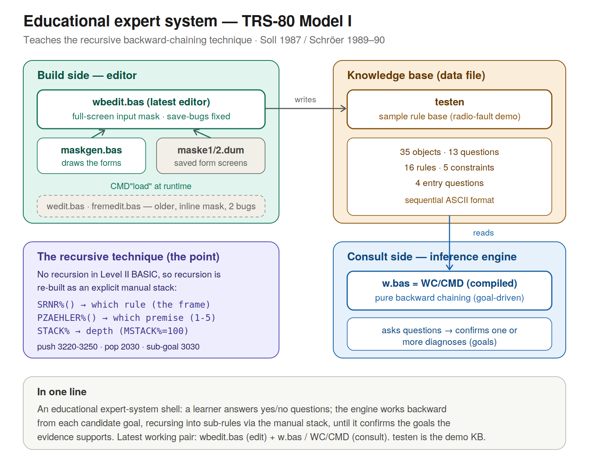
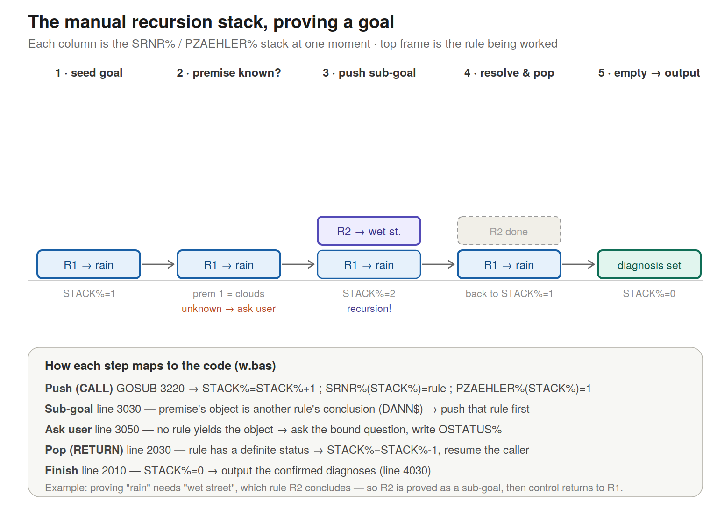

# Expert system — one-page reference

An **educational expert system** for the TRS-80 Model I — built to *teach* how an
expert system works, demonstrating the **recursive BASIC technique** for an inference
engine. Original concept by Dr. H.-J. Soll (1987); ported and extended for the TRS-80
Model I by Egbert Schröer (1989–1990).

The radio-repair knowledge base (`testen`) is only a
sample domain to show the method working — the actual subject of the program is the
inference mechanism itself.



## What the whole thing is

The system has two halves that share a data file:

- An **editor** builds a *knowledge base* (objects, questions, rules, constraints) and
  saves it to disk.
- An **inference engine** loads that knowledge base, asks the user questions, and uses
  **backward chaining** to confirm one or more diagnoses.

### The inference type: backward only

The engine `wc.bas` is a **pure backward-chaining (goal-driven) inference engine**. It is
*not* forward-chaining and not hybrid. Evidence from the code:

- It seeds the stack with **only the diagnosis rules** (`IF TYP%(N%)=1`, line 1130) —
  it starts from the goals it wants to prove, not from known data.
- When it needs an unknown fact, it looks for another rule that *concludes* that fact
  and proves that rule first as a sub-goal (line 3030); only if no rule yields it does
  it ask the user (line 3050).
- There is **no forward sweep** — no loop firing every applicable rule from known facts.
  The constraint routine (the one mildly forward element) lives only in the editors and
  is absent from `wc.bas`.

### The recursive BASIC technique (the point of the exercise)

Soll's teaching idea was to express backward chaining as **recursion**: to prove a goal,
the routine calls itself on each sub-goal. The TRS-80 Model I's Level II BASIC has no
user-defined recursive subroutines, so this port re-implements that recursion with an
**explicit manual stack**:

- `SRNR%(STACK%)` — which rule this stack frame is working on
- `PZAEHLER%(STACK%)` — which premise (1–5) of that rule is being checked
- `STACK%` — the current depth; `MSTACK%=100` is the limit

Mechanics: lines 3220–3250 **push** a frame, line 2030 **pops** one, and line 3030 is
the recursive heart — when a premise's object is itself the conclusion of another rule,
that rule is pushed and worked first (a sub-goal interrupting the current goal), exactly
as a recursive call would behave. The technique is preserved; only its *implementation*
changed from language-recursion to a hand-rolled stack, because the hardware forced it.

## The files — what is latest

| File | Role | Status |
|------|------|--------|
| `wc.bas` | Inference engine (`'Expertensystem / Inferenzkomponente`, 1990). **Full version** — justification, tracer, constraints, printer. Source of the compiled `WC/CMD`. | **Current — the engine you run** |
| `w.bas` | Stripped inference engine (165 lines vs 393). Same backward-chaining core, but justification stubbed, tracer and constraints removed. | Cut-down variant |
| `wbedit.bas` | Knowledge-base editor (`'Wissenserwerbskomponente`, 1989). Full-screen input mask; both save-bugs already fixed. | **Current — the editor you use** |
| `maskgen.bas` | Generates the input-mask screens used by `wbedit`. | Current — build-time tool |
| `maske1.dum`, `maske2.dum` | Saved screen images of the question form and rule form. | Current — data for `wbedit` |
| `testen` | A complete knowledge base: the radio-repair rule set. | Current — sample/working KB |
| `wedit.bas`, `fremedit.bas` | Older editor versions. Inline (line-by-line) input instead of the mask; still contain two save-bugs. | Superseded |
| `druck.bas` | A 3-line `LPRINT` printer fragment, not a standalone program. | Fragment |
| `WC/CMD` | Compiled binary of `wc.bas`. Runs without BASIC; this is what the startup screenshots show. | Current — compiled engine |

Newest working pair: **`wbedit.bas` (edit) + `wc.bas` / `WC/CMD` (consult)**.

## Dependencies

- `wbedit.bas` → loads `maske1/dum` and `maske2/dum` at runtime via `CMD"load …"`
  (lines 4010 and 7010). Those `.dum` files are produced by `maskgen.bas`. Without
  them, `wbedit` cannot draw its entry forms.
- `wc.bas` / `WC/CMD` → needs a **knowledge-base file** (e.g. `testen`), entered at the
  `Name der Wissensbasis` prompt. No knowledge base = nothing to reason over.
- `wedit.bas` / `fremedit.bas` → self-contained (inline mask), need only a KB file.
- `wc.bas` loads and **applies** constraints (`CN$`/`CS%`): after a rule fires it calls
  the constraint evaluator (`GOSUB 5010`) to force dependent facts. It also records a
  full inference **trace** (`TRACER$`) used by the justification component.
- A stripped variant, `w.bas` (165 lines vs 393), exists with the justification, tracer,
  and constraint code removed — its line 6010 prints "Begründungs-Komponente ist nicht
  vorhanden" and it ignores constraints. `wc.bas` is the complete engine and the source
  of `WC/CMD`.

## How the editor captures input (the "Maske" difference)

- `wbedit.bas` (latest): loads a pre-drawn full-screen form (`maske*/dum`), lets you
  fill in the fields, then reads your answers back out of video memory with `PEEK`
  (line 4140 onward). This is the improved input mask.
- `wedit.bas` / `fremedit.bas` (older): just `PRINT` the field labels and collect
  answers with sequential `INPUT` statements — no external mask.

## Knowledge-base file format (sequential ASCII)

Header: `OBJEKTE%`, `FRAGEN%`, `REGELN%`, `CO%` (constraints), `NQ%` (entry questions).
Then, in order:

- per **object**: name `OA$`, status `OSTATUS%` (0/±1), diagnosis flag `ODIAG%`
- per **question**: text `FTEXT$`, answer 1 `FA$(1)`, answer 2 `FA$(2)`, status
  `FSTATUS%`, bound object `FOBJEKT$`
- per **rule**: `RSTATUS%`, then 5×(premise `WENN$`, weight `WF%`), conclusion `DANN$`,
  diagnosis flag `TYP%`
- per **constraint**: antecedent `CN$(1)`, consequent `CN$(2)`, forced status `CS%`
- per **entry question**: object `QU$`

Status codes: `0` unknown, `+1` true, `-1` false. Rule weight `WF%`: `+1` normal,
`-1` negated. An OR-rule is marked by the sentinel `"- oder -"` in premise slot 1.

## What is in `testen` (the sample knowledge base)

`testen` is the demonstration knowledge base — a radio-fault example used to show the
inference engine reasoning over a real rule set. It is sample teaching content, not the
purpose of the program.

35 objects, 13 questions, 16 rules, 5 constraints, 4 entry questions.

Sample questions in it: does the reception indicator deflect on a tuned station; is
music or speech audible; is there hiss at full volume; does the sound seem dull;
reception quality on medium-wave and on FM; is anything audible through headphones;
crackling when turning the volume; volume only ever quiet; can weak stations be
received; are the batteries full.

Sample diagnoses (objects flagged as diagnosis): pre-amplifier defective; tone control
mis-set (no treble); antenna defective; speaker or output stage defective; batteries
empty; no battery contact; batteries exhausted; interference from electrical devices;
poor local reception location; range-selector switch oxidised; volume control dirty.

A session demonstrates the technique: the learner answers a few yes/no questions, and
the engine works backward from each candidate goal — asking only the questions a goal
needs, recursing into sub-rules via the manual stack — until it confirms the goal(s)
the evidence supports.

# Expert System — Theory Overview (TRS‑80 Model I, Soll 1987 / Schröer 1989–90)

This document summarizes the theoretical essence of the TRS‑80 Model I educational
expert‑system shell. It explains what the system *is*, how it reasons, and how recursion
is implemented manually in Level II BASIC.

All code shown is taken verbatim from `wc.bas` (the inference engine, source of the
compiled `WC/CMD`); line numbers are the program's own.



---

## 1. A Rule‑Based Expert System Shell

The system is a full expert‑system shell consisting of:

- **Objects** (`OA$`, `OSTATUS%`, `ODIAG%`)
- **Questions** (`FTEXT$`, `FA$`, `FOBJEKT$`)
- **Rules** (`WENN$`, `WF%`, `DANN$`, `TYP%`)
- **Constraints** (`CN$`, `CS%`) — loaded and applied by `wc.bas` via the evaluator at line 5000

Knowledge acquisition (editor) and knowledge inference (engine) are cleanly separated.

**Relevant code (`wc.bas`, lines 20–100):**

```basic
20  MSTACK%=100
30  DIM SRNR%(MSTACK%),PZAEHLER%(MSTACK%)
80  DIM OA$(OBJEKTE%),OSTATUS%(OBJEKTE%),ODIAG%(OBJEKTE%)
90  DIM FTEXT$(FRAGEN%),FA$(2,FRAGEN%),FSTATUS%(FRAGEN%),FOBJEKT$(FRAGEN%)
100 DIM RSTATUS%(REGELN%),WENN$(5,REGELN%),WF%(5,REGELN%),DANN$(REGELN%),TYP%(REGELN%)
```

Line 30 allocates the manual recursion stack (see §3); lines 80–100 allocate the
objects, questions, and rules.

---

## 2. Pure Backward‑Chaining Inference Engine

The inference engine (`wc.bas` / `WC/CMD`) performs goal‑driven reasoning:

- It begins with **all diagnosis rules** pushed onto the stack.
- For each goal, it attempts to prove all premises.
- If a premise is unknown, it tries to prove it via another rule (**sub‑goal**).
- Only when no rule yields the fact does it **ask the user**.

There is **no forward chaining and no hybrid inference**.

**Seeding the goals (`wc.bas`, lines 1120–1140):**

```basic
1120 FOR N%=1 TO REGELN%
1130 IF TYP%(N%)=1 GOSUB 3220:TRACER$="1="+DANN$(N%):GOSUB 2810   ' push every diagnosis rule as a goal, log it
1140 NEXT N%
```

**The recursive sub‑goal (`wc.bas`, line 3030):**

```basic
3030 IF DANN$(K%)=OA$(N%) THEN M%=N%:N%=K%:GOSUB 3220:N%=M%:GOTO 2020
```

When the object needed by the current goal (`OA$(N%)`) is itself the conclusion
(`DANN$`) of another rule `K%`, that rule is pushed and proved first — a sub‑goal
interrupting the current goal. This is the recursion, expressed without a recursive
call. If no rule concludes the object, control falls through to the dialog component
(line 4410) and the user is asked.

---

## 3. Recursion Re‑Implemented Manually (Explicit Stack)

Level II BASIC has no recursion, so the system simulates it using:

- `SRNR%(STACK%)` → rule number for this frame
- `PZAEHLER%(STACK%)` → which premise (1–5) is being evaluated
- `STACK%` → current depth (`MSTACK%=100`)

This stack behaves exactly like recursive calls: a `GOSUB 3220` pushes a frame (a
simulated CALL), and decrementing `STACK%` pops one (a simulated RETURN).

**Push frame — simulated CALL (`wc.bas`, lines 3220–3250):**

```basic
3220 IF STACK%=MSTACK% THEN CLS:PRINT"**** Stack-Überlauf ****":END
3230 STACK%=STACK%+1
3240 SRNR%(STACK%)=N%:PZAEHLER%(STACK%)=1
3250 RETURN
```

Line 3220 is the depth guard (stack‑overflow check); 3230 grows the stack; 3240 writes
the new frame — the rule number `N%` and premise counter reset to 1.

**Pop frame — simulated RETURN (`wc.bas`, lines 2010–2030):**

```basic
2010 IF STACK%=0 GOTO 4010      ' stack empty -> output diagnoses
2020 IF RSTATUS%(SRNR%(STACK%))=0 GOTO 2510   ' rule not yet resolved -> keep working it
2030 STACK%=STACK%-1            ' rule resolved -> pop the frame, return to caller
```

The main loop tests the top frame: if the stack is empty, reasoning is finished and the
engine outputs its diagnoses (line 4010). If the current rule is still unresolved, it
continues evaluating its premises. Once the rule has a definite status, line 2030 pops
the frame and the loop resumes on the caller's frame — exactly the behaviour of
returning from a recursive call.

`STACK%` is initialised to 0 at line 1110, before the goals are seeded.

---

## 4. Logical Model: AND, OR, and Negation

The system implements a compact three‑valued logic:

- `+1` = true
- `-1` = false
- `0` = unknown

Each premise carries a weight `WF%` of `+1` (plain) or `-1` (negated). A premise is
satisfied when `OSTATUS%(object) * WF% = 1` — a single multiply that handles negation:
a negated premise (`WF% = -1`) is satisfied precisely when its object is false
(`-1 * -1 = 1`).

### AND‑rules

The default. Every premise must be satisfied; the first failure makes the whole rule
false. A rule is an AND‑rule when premise slot 1 is **not** the `"- oder -"` sentinel.

**`wc.bas`, line 2600 (the AND test):**

```basic
2580 IF WENN$(1,SRNR%(STACK%))="- oder -" GOTO 2645
2600 WF%=WF%(PZAEHLER%(STACK%),SRNR%(STACK%))
2605 IF OSTATUS%(N%)*WF%<>1 THEN RSTATUS%(SRNR%(STACK%))=(-1):NM$=DANN$(SRNR%(STACK%)):TRACER$="2="+NM$+"=-1="+WENN$(PZAEHLER%(STACK%),SRNR%(STACK%))+"="+STR$(WF%):GOSUB 2810:GOSUB 3430:OSTATUS%(N%)=(-1):GOTO 2030
2610 PZAEHLER%(STACK%)=PZAEHLER%(STACK%)+1
2620 GOTO 2510
```

If any premise fails the `…<>1` test, the rule's conclusion is set false and the frame
is popped (`GOTO 2030`). Otherwise the premise counter advances and the next premise is
checked. If all five pass, line 2510 sets the rule true.

### OR‑rules

Marked by the sentinel `"- oder -"` in premise slot 1. Any single satisfied premise
makes the rule true; the rule is false only if every premise fails.

**`wc.bas`, line 2640 (the OR test):**

```basic
2640 WF%=WF%(PZAEHLER%(STACK%),SRNR%(STACK%))
2645 IF OSTATUS%(N%)*WF%=1 THEN RSTATUS%(SRNR%(STACK%))=1:NM$=DANN$(SRNR%(STACK%)):TRACER$="5="+NM$+"=1="+WENN$(PZAEHLER%(STACK%),SRNR%(STACK%))+"="+STR$(WF%):GOSUB 2810:GOSUB 3430:OSTATUS%(N%)=1:GOSUB 5010:GOTO 2030
2650 PZAEHLER%(STACK%)=PZAEHLER%(STACK%)+1
2660 GOTO 2510
```

The first premise that passes the `…=1` test sets the conclusion true and pops the
frame. The AND/OR symmetry is clean: AND fails fast on the first `<>1`, OR succeeds fast
on the first `=1`. When a rule fires true, `GOSUB 5010` runs the constraint evaluator and
a `TRACER$` entry is recorded for the justification component (§6).

### Termination of a rule

The premise loop ends at line 2510/2520 once `PZAEHLER%` exceeds 5:

```basic
2510 IF (PZAEHLER%(STACK%)>5 AND WENN$(1,SRNR%(STACK%))<>"- oder -") THEN RSTATUS%(...)=1 ...   ' AND: all premises held -> true
2520 IF (PZAEHLER%(STACK%)>5 AND WENN$(1,SRNR%(STACK%))="- oder -") THEN RSTATUS%(...)=-1 ...   ' OR: none held -> false
```

So an AND‑rule that reaches the end without a failure is **true**; an OR‑rule that
reaches the end without a success is **false**.

---

## 5. Epistemic Model: How Knowledge Is Represented

The system distinguishes four kinds of knowledge:

- **Facts** — objects carrying a status (`OSTATUS%`: `0`/`+1`/`-1`).
- **Questions** — bound to an object via `FOBJEKT$`; used to acquire evidence from the
  user.
- **Rules** — logical inference (`WENN$` premises → `DANN$` conclusion).
- **Diagnoses** — rules flagged `TYP%=1`; these are the goals the engine tries to prove.

Backward chaining means the engine asks only questions **relevant to the goals it is
currently pursuing** — it never asks about objects that no rule chain needs. (It is not
guaranteed to be the theoretical minimum: diagnosis goals are pursued in stored order,
so rule ordering can occasionally cause a question whose answer turns out not to be
decisive.)

### A question is bound to an object

When the engine needs an unknown object, it finds the matching question by name:

**`wc.bas`, lines 4410–4420:**

```basic
4410 FOR L%=1 TO FRAGEN%
4420 IF OA$(N%)=FOBJEKT$(L%) THEN 4520   ' question whose FOBJEKT$ = this object
4430 NEXT L%
```

If no question is bound to the object, the engine falls back to a plain yes/no prompt
(line 4460, "Es fehlt die Frage für …").

### Asking the question and recording the answer

**`wc.bas`, lines 4520–4600:**

```basic
4520 CLS
4530 PRINT @128,FTEXT$(L%)
4540 PRINT @256,"1 -  ";FA$(1,L%)
4550 PRINT @384,"2 -  ";FA$(2,L%)
4560 PRINT @968,"Welche Antwort ist korrekt ? (1,2) ";
4570 I$=INKEY$:IF I$="" THEN 4570
4590 IF I$="1" THEN I%=1:FSTATUS%(L%)=I%:TRACER$="4="+FOBJEKT$(L%)+"=1="+FTEXT$(L%)+"="+FA$(1,L%):GOSUB 2810:CLS:RETURN
4600 IF I$="2" THEN I%=-1:FSTATUS%(L%)=I%:TRACER$="4="+FOBJEKT$(L%)+"=-1"+FTEXT$(L%)+"="+FA$(2,L%):GOSUB 2810:CLS:RETURN
```

Answer 1 yields `+1` (true), answer 2 yields `-1` (false), and each answer also logs a
`"4="` tracer entry recording the question and the chosen answer.

### The answer closes back into the inference state

**`wc.bas`, lines 3050–3070:**

```basic
3050 GOSUB 4410        ' ask the question
3060 OSTATUS%(N%)=I%:IF OSTATUS%(N%)=1 THEN GOSUB 5010   ' record answer; if true, fire constraints
3070 GOTO 2580         ' resume evaluating the rule that needed it
```

This is the full epistemic loop: an unknown object triggers a bound question, the user's
answer becomes the object's status, and the engine resumes the rule that needed it. A
diagnosis is confirmed when its rule reaches status `+1`:

```basic
4030 IF (TYP%(N%)=1 AND RSTATUS%(N%)=1) THEN ANZAHL%=ANZAHL%+1:DIAG%=N%
```

---

## 6. The Begründungskomponente (Explanation Component)

The engine `wc.bas` includes a genuine **explanation facility** — the
*Begründungskomponente* of the book (chapter 2.5). It does three things:

- **Parses the tracer entries** written during inference. Each reasoning step logged a
  tagged record into `TRACER$()` (writer at line 2810); the decoder reads them back.
- **Reconstructs the reasoning chain** that led to each conclusion — which rule fired,
  which premises held, which answers the user gave, which constraints propagated.
- **Prints human-readable explanations** of *why* a fact was derived (blocks 6000–8300),
  with optional printer output (block 10000).

The decoder is small and direct (`6700 Tracer aufschlüsseln`):

```basic
6700 'Tracer aufschlüsseln
6730 TRACER$=TRACER$(N%)
6740 TYP%=VAL(LEFT$(TRACER$,1))                       ' first char = record type
6750 TRACER$=RIGHT$(TRACER$,LEN(TRACER$)-2):IF TRACER$="" THEN RETURN
```

It reads the leading type digit, then splits the remaining `=`-separated fields to
rebuild the explanation. The display blocks then phrase it: list all possible facts
(6200), list the determined facts (6300), show a specific rule (7000), and render an
AND-rule (7500) or OR-rule (7800) as "rule applies / does not apply / undetermined".

### Historical context

This is the same class of feature that made **MYCIN** notable: the ability to explain
its conclusions by walking its reasoning trace and answering *why* a result was reached.
A justification component like this places the program squarely in the 1980s
expert-system explanation tradition — the lineage that prefigured what is now called
**Explainable AI (XAI)**, long before the term existed. (The comparison is to MYCIN's
explanation facility specifically; systems such as PROSPECTOR and OPS5 were known for
other things — probabilistic inference and forward-chaining production matching
respectively — so MYCIN is the apt reference here.)

This whole component is the main capability that the stripped `w.bas` variant drops —
in `w.bas` it is replaced by the stub "Begründungs-Komponente ist nicht vorhanden".

---

## 7. Educational Purpose

Although the sample domain is radio repair, the actual purpose is to teach:

- How expert systems represent knowledge.
- How backward chaining works.
- How recursion can be simulated without language support.
- How logical inference can be encoded using integers and strings.

This system is an **instructional model of an inference engine**, not a domain‑specific
diagnostic tool. The radio‑fault knowledge base (`testen`) is a vehicle for demonstrating
the mechanism; the mechanism — backward chaining, the manual recursion stack, and the
integer/string encoding of three‑valued logic — is the subject being taught.

---

## 8. Engineering Highlights

The interesting part of this port is what it does *despite* the constraints of TRS‑80
Level II BASIC. Six moves stand out.

**1. Recursion without recursion (the central trick).** Level II BASIC has no recursive
subroutines: `GOSUB` cannot re‑enter a running routine while keeping separate state per
call. Backward chaining is naturally recursive — proving a goal means proving its
sub‑goals to arbitrary depth. The solution is a hand‑built call stack: the arrays
`SRNR%()` (which rule a frame is working on) and `PZAEHLER%()` (which premise) together
*are* a stack frame; `GOSUB 3220` is the CALL, decrementing `STACK%` is the RETURN. The
program implements the language feature the hardware lacked.

**2. Three‑valued logic in plain integers.** True / false / unknown are encoded as
`+1 / -1 / 0`. No special type is needed, and this choice sets up move 3.

**3. Negation as multiplication.** A premise is tested in one operation,
`OSTATUS%(object) * WF%`. Because a negated premise carries weight `WF% = -1`, the
multiply handles `NOT` for free — a negated premise is satisfied exactly when its object
is false (`-1 × -1 = +1`). There is no separate "is this negated?" branch; the sign
arithmetic *is* the logic. This works only because of the `±1/0` encoding in move 2.

**4. AND and OR as mirror‑image fast exits.** AND fails fast on the first `<>1`; OR
succeeds fast on the first `=1`. The same evaluation skeleton with the opposite test —
compact and symmetric, which matters on a 1.77 MHz Z80 with tight memory.

**5. Clean editor/engine separation.** Knowledge acquisition (`wbedit`) and inference
(`wc.bas`) are fully decoupled through the knowledge‑base file. This is textbook
expert‑system *shell* architecture — one engine runs any knowledge base — achieved on
1980s hardware.

**6. The input mask reuses video memory as the data buffer.** Instead of a rigid stack
of `INPUT` prompts (what the older `wedit` / `fremedit` editors do), `wbedit` uses a
full‑screen fill‑in form:

- `maskgen.bas` draws the form once and saves the rendered screen as `maske1.dum`
  (question form) and `maske2.dum` (rule form).
- `wbedit` loads the whole form instantly with `CMD"load maske1/dum"` — no field‑by‑field
  redraw.
- It then reads the user's typed answers **straight out of screen RAM with `PEEK`**
  (line 4140 onward).

The screen itself becomes the input buffer — video memory does double duty as display
*and* data store. The result is a form‑style UI (move around fields, looks like a real
application) on a machine with no input‑widget concept. The `PEEK`‑the‑screen idiom was
known on the TRS‑80 (screen RAM was memory‑mapped at a fixed address, which is why it
works), so this is using the machine well rather than inventing a new technique — but it
is a clear step up from the line‑by‑line editors.

Of these, move 1 — the manual recursion stack — is the least obvious and the most
genuinely clever: it is the one that makes a recursive algorithm run on a
non‑recursive language.

**7. A self-describing trace as a tiny serialization format.** Every inference step in
`wc.bas` appends a coded string to `TRACER$()` — for example `"2="+name+"=-1="+premise+"="+weight`.
The leading digit is a record type (`1`=goal pushed, `2`=AND-rule resolved, `5`=OR-rule
resolved, `3`=constraint, `4`=user answer, `9`=overflow), and `=` separates the fields.
The justification component (the *Begründungskomponente*, blocks 6000–8300) later reads
these back with a small parser (`6700 Tracer aufschlüsseln`): it reads the type digit,
splits on `=`, and reconstructs a human-readable explanation of *why* each fact was
concluded — "X is satisfied because all premises held", and so on. In effect the program
defines a compact tagged record format, writes an audit log in it during reasoning, and
decodes it on demand to explain itself (see §6 for the explanation component this feeds).
Building an explanation facility this way — log structured events, parse them back later
— is a sound design idea that holds up well beyond 8-bit BASIC.

---

## 9. What This System Really Is (in one sentence)

A complete educational expert‑system shell that demonstrates backward chaining, manual
recursion, three‑valued logic, constraint propagation, and explainable inference — all
implemented by hand in 1980s BASIC on a TRS‑80 Model I. Not a toy: a working teaching
machine for inference theory.

---

## 10. Source / Reference

This program is an adaptation of the rule‑based BASIC expert‑system example published by
Hans‑Jürgen Soll. The original concept, the recursive inference technique, and the
overall shell architecture are his; the TRS‑80 Model I port, the German‑umlaut handling,
the input‑mask system, and the engine/editor split documented here are the adaptations
made on the Model I (and continued on the Genie III).

**Book:**

> Soll, Hans‑Jürgen. *KI: Expertensysteme programmieren — Einführung in die
> Funktionsweise mit Beispielen in BASIC.* München: Franzis Verlag.
> 195 pages, 10 figures, gebundene Ausgabe (hardback).
> ISBN‑13: 978‑3‑7723‑7622‑1 · ISBN‑10: 3‑7723‑7622‑3.
> Out of print (no longer available from the publisher).

**Edition note:** the copy referenced here is the 1991 Franzis edition. Some catalogues
list a first edition of 1988; the 1991 printing is the one confirmed for this work. The
same Franzis series also appeared with examples in Forth, so when searching, the BASIC
edition is the relevant one for this program.

**Relationship to this code:** the `WENN$`/`DANN$` rule tables, the three‑valued status
logic, and the backward‑chaining inference loop in `wc.bas` follow the book's method
directly; the manual recursion stack (§3) is the implementation route taken because
TRS‑80 Level II BASIC lacks recursive subroutines.

**Direct correspondence between the book's structure and this code.** The component
names in the program are taken straight from the book — the source files' own header
comments (`Wissenserwerbskomponente`, `Inferenzkomponente`) are the book's chapter
titles. The actual table of contents (Deutsche Nationalbibliothek, d‑nb.info/881349542)
maps onto the code as follows:

| Book section | In this code |
|--------------|--------------|
| 2.1 Die Wissensbasis | the knowledge‑base file (objects, questions, rules) |
| 2.2 Die Wissenserwerbskomponente | `wbedit.bas` (its header comment is this exact title) |
| 2.3 Die Inferenzkomponente | `wc.bas` (header comment `Inferenzkomponente`); backward chaining = §2–§4 here |
| 2.3.2 Produktionensysteme | the `WENN$ → DANN$` production rules |
| 2.3.4 Ablaufsteuerung | the manual stack control loop (`SRNR%`/`PZAEHLER%`) |
| 2.4 Die Dialogkomponente | the question‑asking routine (line 4410+) |
| 2.5 Die Begründungskomponente | the justification component — fully implemented in `wc.bas` (blocks 6000–8300, printout 10000); only a stub in the cut-down `w.bas` |
| 3.1 Constraints | the `CN$`/`CS%` mechanism — evaluated in `wc.bas` at line 5000 (`GOSUB 5010`) |
| 3.2 Tracestrukturen | the `TRACER$` trace log (writer 2810, decoder 6700) — the basis of the Begründung |
| 3.6 Vorwärtsverkettung | forward chaining — a later book topic, **not** implemented in `wc.bas` (which is backward‑only) |

This confirms the lineage precisely: the program implements the book's core architecture
(chapter 2 — knowledge base, acquisition, inference, dialog) plus the constraint and
trace techniques from chapter 3, while the chapter‑3 forward‑chaining and
uncertainty extensions were not carried into this engine.