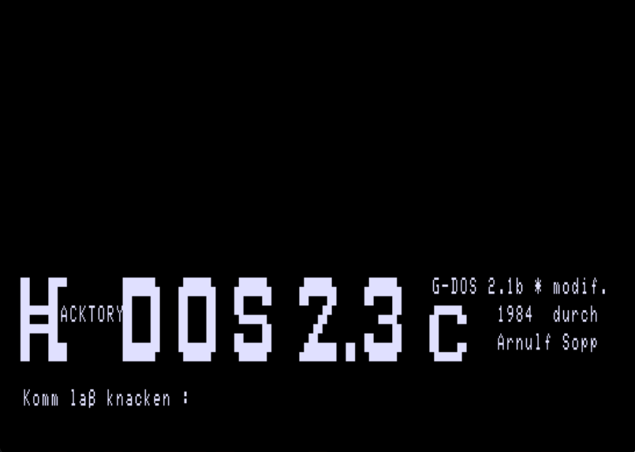

<!-- /diskimages/GDos/hdos.md — H-DOS 2.3c: G-DOS 2.1b modification by Arnulf Sopp (The HACKTORY, 1984) -->
<!-- (c) E. Schroeer -->
# H-DOS 2.3c — G-DOS 2.1b modification by Arnulf Sopp (The HACKTORY, 1984)

Back to the [G-DOS editions index](README.md).



*Boot screen: "H-DOS 2.3c — G-DOS 2.1b \* modif. 1984 durch Arnulf Sopp".
The DOS prompt reads "Komm laß knacken :".*

## What it is

H-DOS is not a new DOS but **G-DOS 2.1b improved through numerous zaps** by
**Arnulf Sopp** of *The HACKTORY* (Lübeck), remaining compatible with G-DOS 2.x
and NEWDOS/80 2.x. The copyright of the underlying G-DOS stayed with TCS;
H-DOS was distributed only to legitimate G-DOS owners, with the buyer's name
encoded on the disk. Everywhere G-DOS names itself, the system now reads
"H-DOS" — including the boot file, which is `HDOS/SYS` instead of `GDOS/SYS`
(verified in the directory of this image).

Fritz Chwolka places H-DOS in its scene: the Genie computers sold well in
Germany largely because they were much cheaper than the TRS-80 Model I, with
NEWDOS/80 and G-DOS dominant because they shipped with the systems (his own
entry point was [Schmidtke electronic, Aachen](http://oldcomputers-ddns.org/public/pub/rechner/eaca/common/dokumentation/genie-nachrichten_no2_ger.pdf),
around 1981/82). The active German TRS-80 user clubs
([Club 80, Club Bremerhaven, Club München](http://oldcomputers-ddns.org/public/pub/rechner/eaca/common/user-clubs/index.html))
pushed for DOS improvements, and a programmer working under the name
*Hacktory* took on G-DOS — the result was H-DOS, passed on to interested
users and discussed in the club magazines of the time.

## Feature overview (from the on-disk manual `ANLEIT/TXT`)

- **`<JKL>` graphics hardcopy** — detects graphics on screen, then offers
  **A** (ASCII only), **P** (positive), or **N** (negative) mixed text/graphics
  printing; with Shift it also dumps the **HRG-1B** high-resolution screen.
  Printer drivers existed for Star Gemini-10X and Epson RX-80 — consistent
  with the two overlay variants `SYS22E/SYS` / `SYS22G/SYS` on this disk
  (Epson/Gemini reading of the suffixes inferred, not byte-verified).
- **`<345>` screen save** — dumps ASCII + pixel + HRG graphics to a
  self-displaying `BILD/CMD`; `GRA/CMD` does the same without needing the
  EG-64 MBA to detect the key combination.
- **`<,./>` memory banking dialog** and **`<567>` print spooler** (12 KB
  buffer) — both require the EG-64 MBA and booting without the left-arrow key
  (or `INI,J`).
- **Acoustic signals** — error beep, a "Kojak siren" on copy/format errors,
  and BEL (ASCII 07) support via the MBA amplifier.
- **Library extensions** — `LWT` (drive speed test) reactivated, `DDE`
  extended (any-format sector access, `T`runcate bit-7 view, `C`ontrol-code
  view), `INI,J/N`, `CLS,G` (clear HRG memory), `OUT` (arbitrary port output),
  `F` (function keys, up to 32 chars each), `B?` (bank status), `*`
  (transparent `LPRINT` codes), `ID` (auto-detect foreign disk PDRIVE
  parameters), and a `V24`/RS-232 service routine for Genie 1/2.

All extensions live in zapped or previously unused SYS files (loading at
4D00–51FFh) and claim no user memory above 5200h and no extra disk space.
H-DOS runs unchanged without the MBA — its absence is detected automatically.

## DOS propmt

Arnulf Sopp (The HACKTORY) has a special sense of humor which resonates to his DOS propmt *Komm laß knacken :* It is — roughly "come on, let's get cracking," with the obvious wink that knacken is also what you do to copy protection. Perfectly on brand for someone calling himself "The HACKTORY" and shipping a DOS built entirely from zaps.

## Hardware context

- **[EG-64 Memory-Banking Adaptor](https://oldcomputers-ddns.org/public/pub/rechner/eaca/genie_1/manuals/eg64-mba_und_64k-erweiterung_(ger_bw).pdf)**
  (TCS) — makes the lower 16 KB of RAM (0000–3FFFh) accessible on a Genie I/II
  with 64 KB. Controlled via **port DFh (223)**: the low 3 bits select one of
  six address blocks (plus the RESET behaviour switch), bit 3 flips that block
  between ROM/I-O and RAM. Blocks are independently switchable — ROM copy
  ("soft ROM"), Level-4 area, floppy I/O, keyboard, and video can each be
  banked separately. The MBA is **emulated in SDLTRS**.
- As Jens Günther notes, such bankers can in principle switch out ROM *and*
  I/O — unproblematic as long as the running program is not itself in that
  address range and re-enables the block around each I/O access. On the
  LNW80/II and the TCS SpeedMaster / Genie IIs, the 480×192 HiRes graphics are
  **memory-mapped** into 0000–3FFFh by the hardware; the **HRG-1B** by
  contrast is driven purely through **OUT ports** and is never banked in —
  which also makes its access considerably slower.
- The H-DOS manual's trademark note independently confirms the HRG-1B
  attribution: "HRG 1B ist ein Warenzeichen der Fa. RB Elektronik Vertrieb
  GmbH".

## This disk image

`DMK/HDOS23c.dmk` — DMK, 40 tracks (41 in the image; one-track imaging
over-read), 2 sides, directory track 21. 48 directory entries, including the
full H-DOS documentation as on-disk text files (`ANLEIT/TXT`, `ARTIKEL/TXT`,
`ARTIKEL1/TXT`, `ARTIKEL2/TXT`, `REFCARD/TXT`) and the utilities `BASIC/CMD`,
`BILD/CMD`, `DEFMEM/CMD`, `GRA/CMD`, `HACKTORY/CMD` (the HACKTORY logo
screen), `RESJKL/CMD`, `SDIR/CMD`, `SYS27/CMD`, `SYSHEX/CMD`.

## Provenance

The disk was read from original media and written up by **Fritz Chwolka**
([forum.classic-computing.de: "H-DOS für Videogenie EG3200"](https://forum.classic-computing.de/forum/index.php?thread/24840-h-dos-f%C3%BCr-videogenie-eg3200/)),
who also converted the accompanying documentation into a readable PDF. He ran
the image under **Jens Günther's [SDLTRS fork](https://gitlab.com/jengun/sdltrs)**:

```
./sdltrs -rom ~/xtrs/eg3200/vg1-tcs-rom.bin -disk0 ~/xtrs/eg3200/h-dos/HDOS23c.dmk -charset1 genie
```

Technical notes on the EG-64 MBA, memory banking, and the HRG-1B above are due
to **Jens Günther**.