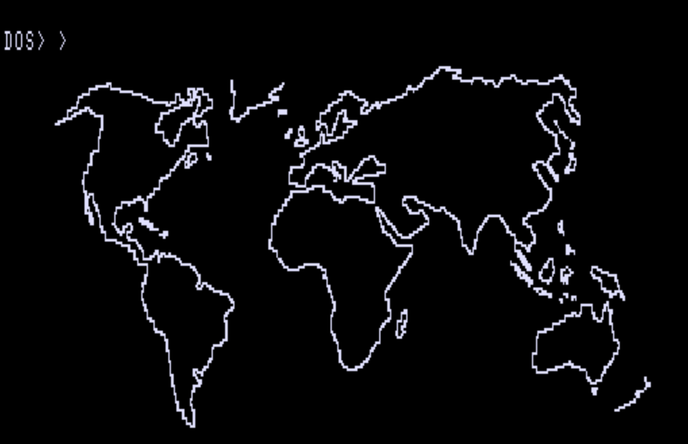

## Disk Images

1. HRGDos - NewDos80: esnd-01.dmk

HRGDOS use the HRG1b

2. GDos 2.2: esnd-02.dmk

PDRAW vers 1.2 by Kim Watts, Breeze/QSD Inc, Dallas

3. NewDos 80 Systemdiskette H. Schuller

4. NewDos80: esnd-04.dmk

5. NewDos80+10 (+ erweiterte Lib) 40Tr DSDD: esnd-04.dmk

und Scripsit Erweiterung von Egbert Schröer (c) 1988

start mit WP SP
Club 80 Artikel?

6. NewDos80: esnd-06.dmk

[Basic commands](http://www.trs-80.org/trsdos-model1-basic/)

7. NewDos80 40 Tr: esnd-07.dmk

Basic program cfgmake/bas zur Definition von Formaten

8. NewDos80 +10 Version 2.5: esnd-08.dmk

Loadhrg/cmd schaltet Hrg1b ein und laedt ein Image im Format /hrg. CHL/CMD loescht den HRG1b Bildschirm

HRGPack

BASCOM/CMD Basic compiler mit runtime library

9. : esnd-09.dmk