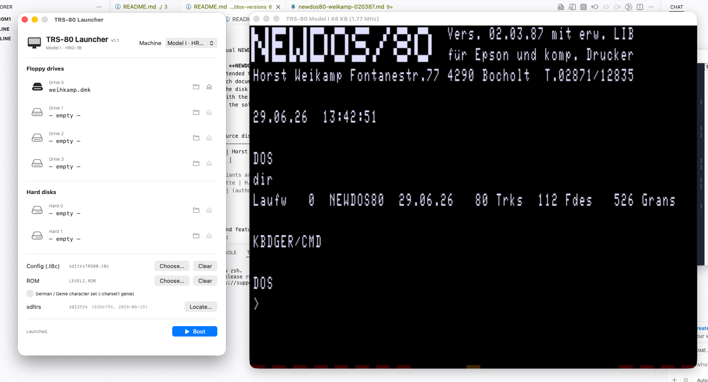

# NEWDOS/80 V2.0 — Weikamp Edition, Vers. 02.03.87 mit erweiterter LIB

*Dokumentation der von Horst Weikamp (DL9YAP) erweiterten NEWDOS/80-Version.*
*Quellen: Boot-Bildschirm, Release-Notizen (UEBERSIC.TXT, DOS0387.TXT) und die binären SYS-Overlays (SYS15, SYS22, SYS23, SYS25, SYS26, SYS27, SYS28). Wo möglich sind Aussagen am Binärinhalt verifiziert.*

---

## Deutsch

### 1. Identifikation

Erweiterte Variante von **NEWDOS/80 V2.0** (Original Apparat Inc.), bearbeitet und vertrieben von **Horst Weikamp**, Funkrufzeichen **DL9YAP**, Fontanestr. 77, 4290 Bocholt, Tel. 02871/12835. Boot-Version **02.03.87**, ausgelegt für **Epson- und kompatible Drucker**.

Eigenständige Signaturen im Binärcode bestätigen die Autorschaft:
- SYS25/SYS enthält den Klartext **`DL9YAP FEB. 1987`**.
- Der von SYS26/SYS aufgerufene SYSGEN installiert auf der Zieldiskette ein DOS namens **`DL9YAPDOS`** (String `DL9YAPDOS INSTALLED`).

### Saubere Master-Diskette (Download)

Ein frisch erzeugtes, bootfähiges Master-Image dieses Systems steht zum Download bereit:

- **Disk-Image:** [weikamp.dmk](DMK/weikamp.dmk) — 80 Spuren DS-DD, NEWDOS/80 (DL9YAPDOS), per SYSGEN von der Original-Systemdiskette erzeugt. Enthält das System (SYS0–SYS28) und die Boot-Spuren, ohne Anwenderdateien.

*Boot unter SDLTRS (Model I / HRG-1B). `DIR` der sauberen Master-Diskette: 80 Spuren, 112 Datei-Einträge, 526 freie Granulen.*

### 2. Architektur der Erweiterungen (verifiziert)

Die Library wurde von SYS1/SYS in das ursprünglich ungenutzte **SYS15/SYS** ausgedehnt. SYS15 ist auf dieser Diskette nur 241 Byte groß und enthält im Wesentlichen die **Befehlsnamen-Tabelle** der erweiterten LIB — die ASCII-Namen sind direkt im File ablesbar:

> `DIRSORT REPORT STOP CALL CLEAN RESET SYSGEN CLH OFF BANK UNKILL COM EDIT XDIR ZAP KEY ,./`

Verteilung der Routinen auf die SYS-Overlays (am Binärinhalt belegt):

| SYS-File | Größe | Nachgewiesener Inhalt |
|----------|-------|------------------------|
| **SYS15** | 241 B | LIB-Befehlsnamen-Tabelle (erweiterte Library) |
| **SYS22** | 7680 B | **SUPERZAP** — vollständiger ZAP mit NEWDOS-Fehlertexten, Signatur `APPARAT`; enthält XCOPY/XOD-Funktionen |
| **SYS23** | 768 B | **XDIR** — „Extended Directory", Aufrufmuster `DDIR,I,A`, Joker `?`, „Press <ENTER> to continue" |
| **SYS25** | 1280 B | Umlauttreiber, KEY (-456-), STOP (Passwort), RESET-Druckertabelle; Autortag `DL9YAP FEB. 1987` |
| **SYS26** | 4096 B | COM (Makros 0–9), EDIT (Screen-Editor), UNKILL (RESCUE), SYSGEN (`DL9YAPDOS`) |
| **SYS27** | 905 B | **DIRSORT** — „Disk Directory Sorting Utility, Version 1.4 ** HWB ** 3/18/84" |
| **SYS28** | 1267 B | **HRG-Bildschirmdruck** mit Disk-Format-Erkennung (`80/SD 80/DD 40/SD 40/DD`) |

Wichtige Einschränkung (laut DOS0387.TXT): SYS26 und SYS27 laden **nicht** im DOS-Overlay-Bereich. Die Befehle RD, `,./`, UNKILL, SYSGEN, EDIT, COM und DIRSORT dürfen daher **nicht aus Unterprogrammen** aufgerufen werden.

Bekannte Inkompatibilität: Da SYS15/SYS keine Nullen mehr enthält, hält **OMNITERM** den Rechner fälschlich für ein Modell III und läuft nicht.

### 3. Befehlsübersicht der erweiterten LIB

| Befehl | Funktion |
|--------|----------|
| `PD` | Kurzform von PDRIVE |
| `S` | Kurzform von SYSTEM |
| `ID` | identifiziert PDRIVE-Parameter selbsttätig (`ID 1` = Memory, `ID 1 A` = auf Diskette schreiben) |
| `HI` / `LO` | High-Speed / Low-Speed (über `OUT 254`) |
| `ON` / `OFF` | HRG-Bildschirm ein / aus |
| `CLH` | HRG-Bildschirm löschen |
| `,./` | sichert HRG- + ASCII-Bildschirm gemeinsam als BILD/CMD |
| `RD` | liest ein Bild in die HRG und zeigt es an (Format gleichgültig) |
| `BANK` | aktiviert die EPROM-Bank von Roos-Elektronik (Sprung nach 3000H) |
| `CALL` | Sprung an Adresse, HEX und DEZIMAL |
| `GO` | startet bereits geladenes Maschinenprogramm (nur HEX) |
| `UM` | Umlauttreiber, 71 Byte, Aktivierung mit SHIFT-@ |
| `EDIT` | Screen-Editor (CLEAR = Insert, Halten = Delete, BREAK = Abbruch) |
| `COM` | führt vordefinierte längere DOS-Kommandos aus (COM,0–COM,9) |
| `REPORT` | Bildschirmausgabe zusätzlich auf Drucker (`REPORT,Y` / `,N`) |
| `RESET` | setzt Drucker auf definierte Schriftart (anpassbar in SYS25) |
| `STOP` | hält den Rechner an, Fortsetzung mit ENTER; `STOP,PASSWORT` |
| `DIRSORT` | sortiert das Directory alphabetisch |
| `CLEAN` | entfernt gekillte Einträge endgültig und überschreibt mit Nullen |
| `SYSGEN` | erzeugt neue Systemdiskette mit aktuellen PDRIVE-Parametern |
| `UNKILL` | stellt gekillte Files zur Reorganisation wieder her |
| `XDIR` | Extended Directory mit `?` als Joker |
| `ZAP` | ruft den modifizierten SUPERZAP auf (HEX/ASCII per CLEAR) |
| `IO` | Wert an Port ausgeben/einlesen, nur HEX |
| `KEY` | eigene Dreitastenfunktion (max. 16 Byte), Aufruf mit 456 |

### 4. Verifizierte Detailbefunde aus den Binärdateien

**SYS22 / SUPERZAP** — ist ein vollständiger Sektor-/Datei-Editor (Strings: DRV, TRK, TRS, DRS, FRS, DD; Funktionen XCOPY, XOD, XXIT; „(Y OR N)"). Trägt die Signatur `APPARAT` und den kompletten NEWDOS-Fehlertextsatz. Bestätigt: ZAP liegt tatsächlich in SYS22.

**SYS25** — enthält drei nachweisbare Funktionsblöcke:
- *Umlauttreiber*: `Umlauttreiber bereit mit <SHIFT @>` — bestätigt die Aktivierung per SHIFT-Klammeraffe.
- *STOP*: `PASSWORD` / `MASTERPW` / `CPU STOPPED AT XX:XX:XX`.
- *RESET*: die Druckertabellen-Marken `:DEL=  :LEN=  :TAB=` liegen wörtlich im File — exakt wie in DOS0387.TXT zur Drucker-Anpassung beschrieben.
- *KEY*: `Gebe max. 16 Zeichen f}r die -456- Funktion ein:`.

**SYS26** — vier Funktionen nachgewiesen:
- *SYSGEN*: `STARTING DISKETTE SYSTEM GENERATOR`, installiert `DL9YAPDOS`, enthält die JCL-artige Befehlssequenz (`FORMAT,1,NewDos80,27/12/86,MASTERPW,Y,NDMW` / `COPY,SYS0/SYS:0,:0` / `PROT,0,RUF`). Das `PROT,0,RUF` bestätigt zugleich Herrn **Ruf** als Mitautor der Library.
- *UNKILL/RESCUE*: deutscher Klartext `Rekonstruktion geloeschter Files fuer APPARAT's NEWDOS/80 2.0`, mit Statusmeldungen „Vollstaendig / Teilweise / Nicht zu rekonstruieren".
- *EDIT*: `Screen-Editor aktiv mit Cleartaste`.
- *COM*: enthält die **tatsächliche Makro-Tabelle** (siehe unten).

**COM-Makros (Stand dieser Diskette, wörtlich aus SYS26):**

| Makro | Belegung |
|-------|----------|
| `COM,0` | `COPY,0,1,,CBF,NFMT,USR,CFWO,NDMW` |
| `COM,1` | `COPY,1,0,,CBF,NFMT,USR,CFWO,NDMW` |
| `COM,2` | `COPY,0,1, ,FMT,NDMW` |
| `COM,3`–`COM,8` | noch nicht belegt |
| `COM,9` | `BASIC,RUN"LOHN187` |

(`COM,9` ruft ein Lohnabrechnungs-BASIC namens LOHN187 auf — ein Hinweis auf den praktischen Einsatz des Systems.)

**SYS27 / DIRSORT** — deutscher Ablauf: „Lese Directory von Laufwerk → Sortiere Directory → Bilde Hit Sector neu → Schreibe neues Directory". Eigentliche Engine: „Disk Directory Sorting Utility, Version 1.4 ** HWB ** 3/18/84".

**SYS28 / HRG-Druck** — erkennt das Diskettenformat (`80/SD`, `80/DD`, `40/SD`, `40/DD`) und fordert „<NL>, wenn Testdisk in Lw. 0 / Systemdisk in Lw. 0". Entspricht dem in DOS0387.TXT beschriebenen JKL-/SHIFT-JKL-Bildschirmdruck.

### 5. BASIC-Besonderheiten

Laut DOS0387.TXT in **SYS29** untergebracht (LINEINPUT/INSTR korrekt, Befehle LINE, NAME, L100). **Hinweis:** Auf dieser Diskette (`NEWDOS80-80Track.DSK`) existiert **kein File SYS29/SYS** — die Systemdateien laufen lückenlos von SYS0 bis SYS28. Der zugehörige Demo-File `LINEDEMO/BAS` ist jedoch vorhanden. Die BASIC-Erweiterungen sind also funktional Teil dieses Builds, aber nicht in einem eigenständigen File namens SYS29 abgelegt; dieses Detail der Release-Notiz ist auf dieser Diskette nicht durch ein File gedeckt.

### 6. Mitwirkende (aus Notizen und Binärsignaturen)

- **Horst Weikamp (DL9YAP)** — eigene Erweiterungen (ON/OFF/CLH/HI/LO/BANK/GO/UM/IO/KEY, COM, EDIT, `,./`), deutsche Texte, Gesamtzusammenstellung. Signatur in SYS25 und SYS26.
- **Herr Ruf** — Basis der erweiterten Library, REPORT/STOP/CALL/CLEAN/RESET; bestätigt durch `PROT,0,RUF` in SYS26.
- **A. Sopp / U. Heidenreich** — HRG-Druck (SYS28).
- **Willi Lohmann** — RD-Befehl, DP510/515-Druckeranpassung.
- **Ralf Folkerts / Kajot Mühlenbein** — Konzept des Umlauttreibers.
- **Zaps** von Miliczek und Trappschuh.

---

## English

### 1. Identification

An extended variant of **NEWDOS/80 V2.0** (originally Apparat Inc.), revised and distributed by **Horst Weikamp**, amateur-radio callsign **DL9YAP**, Fontanestr. 77, 4290 Bocholt, Germany, tel. 02871/12835. Booted build **02.03.87**, configured for **Epson and compatible printers**.

Authorship is confirmed by signatures inside the binaries:
- SYS25/SYS contains the plaintext **`DL9YAP FEB. 1987`**.
- The SYSGEN in SYS26/SYS installs a DOS named **`DL9YAPDOS`** on the target disk (string `DL9YAPDOS INSTALLED`).

### Clean master image (download)

A freshly generated, bootable master image of this system is available for download:

- **Disk image:** [weikamp.dmk](DMK/weikamp.dmk) — 80-track DS-DD, NEWDOS/80 (DL9YAPDOS), generated via SYSGEN from the original system disk. Contains the system (SYS0–SYS28) and boot tracks, with no user files.

*Booting under SDLTRS (Model I / HRG-1B). `DIR` of the clean master: 80 tracks, 112 file slots, 526 granules free.*

### 2. Extension Architecture (verified)

The library was expanded from SYS1/SYS into the originally unused **SYS15/SYS**. On this disk SYS15 is only 241 bytes and essentially holds the **command-name table** of the extended LIB — the ASCII names are directly readable in the file:

> `DIRSORT REPORT STOP CALL CLEAN RESET SYSGEN CLH OFF BANK UNKILL COM EDIT XDIR ZAP KEY ,./`

Distribution of routines across the SYS overlays (evidenced by binary content):

| SYS file | Size | Confirmed content |
|----------|------|--------------------|
| **SYS15** | 241 B | LIB command-name table (extended library) |
| **SYS22** | 7680 B | **SUPERZAP** — full ZAP with NEWDOS error strings, `APPARAT` signature; includes XCOPY/XOD |
| **SYS23** | 768 B | **XDIR** — "Extended Directory", call pattern `DDIR,I,A`, `?` wildcard |
| **SYS25** | 1280 B | Umlaut driver, KEY (-456-), STOP (password), RESET printer table; author tag `DL9YAP FEB. 1987` |
| **SYS26** | 4096 B | COM (macros 0–9), EDIT (screen editor), UNKILL (RESCUE), SYSGEN (`DL9YAPDOS`) |
| **SYS27** | 905 B | **DIRSORT** — "Disk Directory Sorting Utility, Version 1.4 ** HWB ** 3/18/84" |
| **SYS28** | 1267 B | **HRG screen print** with disk-format detection (`80/SD 80/DD 40/SD 40/DD`) |

Critical constraint (per DOS0387.TXT): SYS26 and SYS27 do **not** load in the DOS overlay area. The commands RD, `,./`, UNKILL, SYSGEN, EDIT, COM, and DIRSORT must therefore **never be called from subroutines**.

Known incompatibility: because SYS15/SYS no longer contains zero bytes, **OMNITERM** mistakes the machine for a Model III and fails to run.

### 3. Extended LIB Command Reference

| Command | Function |
|---------|----------|
| `PD` | shorthand for PDRIVE |
| `S` | shorthand for SYSTEM |
| `ID` | auto-identifies PDRIVE parameters (`ID 1` = memory, `ID 1 A` = write to disk) |
| `HI` / `LO` | high-speed / low-speed (via `OUT 254`) |
| `ON` / `OFF` | HRG screen on / off |
| `CLH` | clear HRG screen |
| `,./` | save HRG + ASCII screen together as BILD/CMD |
| `RD` | read an image into the HRG and display it (any format) |
| `BANK` | activate Roos-Elektronik EPROM bank (jump to 3000H) |
| `CALL` | jump to address, HEX and DECIMAL |
| `GO` | start an already-loaded machine program (HEX only) |
| `UM` | Umlaut driver, 71 bytes, activated with SHIFT-@ |
| `EDIT` | screen editor (CLEAR = insert, hold = delete, BREAK = abort) |
| `COM` | run predefined longer DOS commands (COM,0–COM,9) |
| `REPORT` | echo screen output to printer (`REPORT,Y` / `,N`) |
| `RESET` | reset printer to a defined typeface (configurable in SYS25) |
| `STOP` | halt the machine, resume with ENTER; `STOP,PASSWORD` |
| `DIRSORT` | sort the directory alphabetically |
| `CLEAN` | permanently remove killed entries and overwrite with zeros |
| `SYSGEN` | generate a new system disk with the current PDRIVE parameters |
| `UNKILL` | restore killed files for reorganization |
| `XDIR` | extended directory with `?` wildcard |
| `ZAP` | invoke the modified SUPERZAP (HEX/ASCII via CLEAR) |
| `IO` | output/read a value at a port, HEX only |
| `KEY` | define a custom three-key function (max 16 bytes), invoked with 456 |

### 4. Verified Findings from the Binaries

**SYS22 / SUPERZAP** — a full sector/file editor (strings DRV, TRK, TRS, DRS, FRS, DD; functions XCOPY, XOD, XXIT; "(Y OR N)"). Carries the `APPARAT` signature and the complete NEWDOS error-text set. Confirms ZAP genuinely resides in SYS22.

**SYS25** — three demonstrable functional blocks:
- *Umlaut driver*: `Umlauttreiber bereit mit <SHIFT @>` — confirms activation via SHIFT-@.
- *STOP*: `PASSWORD` / `MASTERPW` / `CPU STOPPED AT XX:XX:XX`.
- *RESET*: the printer-table markers `:DEL=  :LEN=  :TAB=` appear verbatim — exactly as DOS0387.TXT describes for printer adaptation.
- *KEY*: prompt to enter up to 16 characters for the -456- function.

**SYS26** — four functions evidenced:
- *SYSGEN*: `STARTING DISKETTE SYSTEM GENERATOR`, installs `DL9YAPDOS`, contains the JCL-like sequence (`FORMAT,1,NewDos80,27/12/86,MASTERPW,Y,NDMW` / `COPY,SYS0/SYS:0,:0` / `PROT,0,RUF`). The `PROT,0,RUF` also confirms **Mr. Ruf** as a library co-author.
- *UNKILL/RESCUE*: German plaintext `Rekonstruktion geloeschter Files fuer APPARAT's NEWDOS/80 2.0`, with status messages for fully / partially / not reconstructible.
- *EDIT*: `Screen-Editor aktiv mit Cleartaste`.
- *COM*: contains the **actual macro table** (below).

**COM macros (as on this disk, verbatim from SYS26):**

| Macro | Definition |
|-------|------------|
| `COM,0` | `COPY,0,1,,CBF,NFMT,USR,CFWO,NDMW` |
| `COM,1` | `COPY,1,0,,CBF,NFMT,USR,CFWO,NDMW` |
| `COM,2` | `COPY,0,1, ,FMT,NDMW` |
| `COM,3`–`COM,8` | not yet assigned |
| `COM,9` | `BASIC,RUN"LOHN187` |

(`COM,9` launches a payroll BASIC program named LOHN187 — a hint at the system's practical use.)

**SYS27 / DIRSORT** — German workflow: read directory → sort → rebuild HIT sector → write new directory. Underlying engine: "Disk Directory Sorting Utility, Version 1.4 ** HWB ** 3/18/84".

**SYS28 / HRG print** — detects disk format (`80/SD`, `80/DD`, `40/SD`, `40/DD`) and prompts for test/system disk in drive 0. Matches the JKL / SHIFT-JKL screen dump described in DOS0387.TXT.

### 5. BASIC Specifics

Per DOS0387.TXT these reside in **SYS29** (correct LINEINPUT/INSTR; commands LINE, NAME, L100). **Note:** on this disk (`NEWDOS80-80Track.DSK`) **no SYS29/SYS file exists** — the system files run unbroken from SYS0 to SYS28. The associated demo `LINEDEMO/BAS` is, however, present. The BASIC extensions are thus functionally part of this build but are not stored in a standalone file named SYS29; this detail of the release note is not backed by a file on this disk.

### 6. Contributors (from notes and binary signatures)

- **Horst Weikamp (DL9YAP)** — own extensions (ON/OFF/CLH/HI/LO/BANK/GO/UM/IO/KEY, COM, EDIT, `,./`), German texts, overall assembly. Signature in SYS25 and SYS26.
- **Mr. Ruf** — basis of the extended library, REPORT/STOP/CALL/CLEAN/RESET; confirmed by `PROT,0,RUF` in SYS26.
- **A. Sopp / U. Heidenreich** — HRG printing (SYS28).
- **Willi Lohmann** — RD command, DP510/515 printer adaptation.
- **Ralf Folkerts / Kajot Mühlenbein** — Umlaut-driver concept.
- **ZAPs** from Miliczek and Trappschuh.

---

*Verification basis: directory parse of NEWDOS80-80Track.DSK (DMK, 80-track DS-DD, SYS0–SYS28 present, no SYS29) and string analysis of SYS15/22/23/25/26/27/28. Author signatures `DL9YAP FEB. 1987` (SYS25) and `DL9YAPDOS` (SYS26) confirm Weikamp's authorship; `PROT,0,RUF`, `HWB 3/18/84`, and `APPARAT` confirm the contributor and provenance chain.*