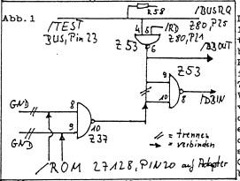
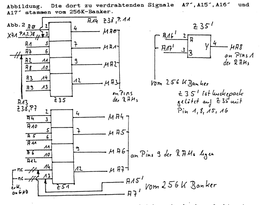

<!-- /hardware/model1-tuneup-1992.md — digitized primary source -->
<!-- Repository file (c) Egbert Schroeer, 2026 -->
<!-- Article authorship: Helmut Bernhardt, Egbert Schröder, Claus Ruschinski, 1992 -->

# TRS-80 Model I Tuneup .. Hardware (Club 80 INFO 38, Dezember 1992)

**Article authors:** Helmut Bernhardt, Egbert Schröder, Claus Ruschinski
**Published:** *Club 80 INFO* Nr. 38, December 1992, pp. 21–27
**Subject:** Hardware modification of a TRS-80 Model I — double-density floppy
controller (WD2793), 256K bank-switch board, and a manual 5.3 MHz speed-up —
plus the CP/M 3.0 boot-disk geometry used on the resulting machine.

This is a primary source: the author's own build documentation for the physical
TRS-80 Model I that most of this collection's disks were created on. It is the
hardware referenced in the root hardware list, and the banker it describes is
the one the [SideKick](../software/sidekick/README.md) multi-computer switch
depends on.

> **Transcription notes.** The German text below is transcribed faithfully from
> the four scanned magazine columns. The scan renders umlauts inconsistently
> (some appear as `X`, e.g. "Xnderungen"); these are restored to correct German
> (`Änderungen`) as clear scan artifacts, not editorial changes. Pin numbers, IC
> designations (Z-numbers, 74LSxx), port addresses, and the BASIC test listing
> are transcribed exactly as printed. Uncertain readings are marked `[?]`.
> Original margin notes read "Club 80 / INFO 38 / Dez. 92" with page numbers
> 21–27.

---

## Overview (author's structure)

The Tuneup consists of four parts (from the Vorwort):

1. Building a Double-Density board based on a WD2793.
2. Connecting a new address decoder.
3. Installing a 256K (or larger) banker.
4. Speed-up (from 1.7 to 5.3 MHz).

> **Note (Vorwort, p. 21):** For the Japanese version of the "Trash 80," the
> described changes must be checked and compared first!
> *(Beachten: Bei der Japan Version des Trash 80 müssen die beschriebenen
> Änderungen geprüft und verglichen werden!!!!)*

---

## 1. Vorwort / Foreword

**Deutsch:**

In einem Club Info Jahrgang 1990 bot Hans-Günther Hartmann Hardware-Restposten
unter anderem für das Model I an. Dazu gehörte auch das Big Mem Board, welches
den TRS80 Model I auf 94 K erweiterte. Kurz nach Erscheinen des
Restposten-Angebots war ich (E.S.) im Besitz dieses Boards und mir die
dazugehörige Paperware von 1cm Dicke bei Helmut besorgen.

Der wiederum schlug mir vor, anstatt des Big Mem Boards seinen Adressdecoder und
Banker einzubauen. Nach Sichten der Möglichkeiten schien mir dies auch der
eleganteste Weg zu sein. Allerdings mußte die Schaltung von Helmut, deren Umbau
bisher nur für den Genie I ausgeführt hatte, ferndiagnostisch ausgeguckt und in
endlosen Telefonsessions mit mir abgeglichen werden (vielen Dank Helmut), da
gleichzeitig auch ein Double Density Controler zu kreieren war. Da ich keinerlei
Hardware Kenntnisse bestand meine Arbeit nur aus dem Nachbau nach Helmut'schen
Angaben und Beschreibung der auftretenden Fehler. Alle Angaben und Fehler wurden
von mir dokumentiert um Nachbauern die Arbeit zu erleichtern und Helmut sich die
Mühe zu ersparen nochmals den Kram auszugucken.

Es sei an dieser Stelle nicht verschwiegen, daß der Umbau am Model I nie
vollständig beendet wurde, da eine Überspannung im VEW-Netz meinem zu diesem
Zeitpunkt 3 Jahre alten Rechner plus einem nagelneuen 80 Track Laufwerk den
Garaus machte. Mittlerweile hat Claus Ruschinski den Teil soweit repariert, daß
es wieder mit Single Density läuft; Double Density ist noch nicht möglich, obwohl
der Doubler in Ordnung ist (vielen Dank Claus). Den Umbau habe ich aber — mit
Helmuts Hilfe — auf einem Genie I fortgeführt und bis auf eine falsch
geschaltete Adresse (A13; tja Helmut immer noch !!) läuft die Sache.

Der Umbau sieht also so aus:

Das Model 1 wird mit 8 Stück 41256-RAMs anstelle der 4116er auf dem CPU-Board
bestückt. Dafür sind vorher noch einige Umrüst-Arbeiten fällig (dazu später
mehr). In dem Sockel des Z80 wird das FC-Switchboard mit einem Z80B (oder höher)
gesteckt, welches die Freigabe-Signale für alle Memory Mapped Signale
beisteuert. Das Level II Basic befindet sich auch auf diesem Board.
Anschließend wird der 256K Banker eingebaut, um mit den 256K auch vernünftig
umgehen zu können. Dann wird von Hand eine Schaltung gestrickt, die das
Umschalten entweder der unteren oder oberen 256K bit steuert, also je nach zu
bootendem Betriebssystem NewDos oder CP/M Anforderung. Und völlig unabhängig
davon wird eine Minimal-Speed-Umschaltung mit einem Handschalter konstruiert.

Das Tuneup besteht somit aus 4 Teilen:
1) Aufbau eines Double Density Boards auf Basis eines WD2793
2) Anschluß eines neuen Adressdecoders
3) Einbau eines 256 K (oder mehr) Bankers
4) Speed up (von 1,7 auf 5,3 MHz)

**English:**

In a 1990 issue of Club Info, Hans-Günther Hartmann offered hardware remainders,
among them parts for the Model I. This included the Big Mem board, which
expanded the TRS-80 Model I to 94 K. Shortly after the remainder offer appeared
I (E.S.) had this board, and obtained the accompanying 1 cm-thick paperwork from
Helmut.

Helmut, in turn, suggested that instead of the Big Mem board I install his
address decoder and banker. After reviewing the options this seemed the most
elegant route. However, Helmut's circuit — whose conversion he had so far only
carried out for the Genie I — had to be worked out by remote diagnosis and
reconciled with me in endless phone sessions (many thanks Helmut), since a
double-density controller had to be created at the same time. As I had no
hardware knowledge, my work consisted only of reproducing Helmut's
specifications and documenting the faults that arose. I documented all the
details and errors to make the work easier for those rebuilding it, and to spare
Helmut the trouble of working it all out again.

Let it not be concealed here that the Model I conversion was never fully
finished, because an overvoltage on the VEW power grid finished off my
then-3-year-old computer plus a brand-new 80-track drive. Claus Ruschinski has
since repaired it far enough that it runs again in single density; double
density is not yet possible, although the doubler is fine (many thanks Claus). I
continued the conversion — with Helmut's help — on a Genie I, and apart from one
incorrectly wired address (A13; well Helmut, still !!) the thing runs.

So the conversion looks like this:

The Model I is populated with 8× 41256 RAMs in place of the 4116s on the CPU
board. Some retrofit work is needed first (more on that later). Into the Z80
socket, the FC-Switchboard is plugged with a Z80B (or higher), which supplies
the enable signals for all memory-mapped signals. The Level II Basic also lives
on this board. Then the 256K banker is installed, to make sensible use of the
256K. Then a circuit is hand-wired that controls switching either the lower or
upper 256K bank, depending on the operating system to be booted (NewDos or CP/M
requirement). And completely independently, a minimal speed switch is built with
a manual toggle.

The Tuneup thus consists of 4 parts:
1) Building a double-density board based on a WD2793
2) Connecting a new address decoder
3) Installing a 256K (or larger) banker
4) Speed-up (from 1.7 to 5.3 MHz)

---

## 2. Double-Density Board (WD2793)

**Deutsch:**

Unter dem Titel SELBSTBAU DOUBLER FÜR EXP1 ist in einem älteren Club-Info hierzu
ein Artikel von Helmut veröffentlicht worden. Diese Bau-Anleitung betrifft in
den GENIE I. Für den TRS 80 sind einige kleine Modifikationen notwendig.
Grundlage des Doublers ist der WD2793 Floppycontroler. Für Eindzelheiten zu
diesem Board wird auf den GENIE I verwiesen. Folgende Änderungen müssen für den
TRS 80 Model I durchgeführt werden: (die Bezeichnungen der IC's und Widerstände
entsprechen den Angaben im Hardware Handbuch Expansion Interface Cat. Nr.
26-1140/1141/1142).

1) Die invertierenden Treiber Z50 und Z51 (74LS240) müssen ausgelötet und, am
besten gesockelt, durch die nicht invertierenden pinkompatiblen Treiber 74LS04
ersetzt werden. Sollten Fehler auftreten, können durch einfaches Aushebeln die
alten Treiber eingesetzt werden.

2) FD DATA geht von Pin 27 des durch ein Huckepack-Board zu ersetzenden VD1771
FDC an Pin 8 des IC's Z32, Typ 74LS04. Man lötet dieses IC am besten aus und
sockelt ein IC gleichen Typs ohne Pin 8 und 9 (abkneifen oder besser aus der
Fassung biegen).

3) Von Pin 9 des Z32 geht über den Widerstand R22 READ DATA* an den Floppy Disk
Bus J5 (Pin 30). Der Widerstand R22 muß ausgelötet werden.

Dies sind alle Änderungen. Der VD1771 FDC wird nun aus seinem Sockel
herausgelöst und durch das Huckepackboard mit WD 2793 FDC ersetzt.

Durch Booten und gleichzeitiges Drücken der BREAK-Taste sollte man nun in das
LEVEL 2 Basic gehen, und die einwandfreie Funktion des neuen FDC mit folgendem
kleinen Basic Programm testen:

```
10: FOR X = 14304 TO 14319
20:   PRINT PEEK X;
30: NEXT X
40: PRINT
50: GOTO 10
```

Es werden folgende 16 Bytes ausgegeben:
```
ersten   4: 63 127 191 ???      ? für uns ohne Bedeutung
nächsten 4: ?? ??? ??? ???
         4: ?? ??? ??? ???
         4: 128 0   0   0        0 zufällig
```
Von den Adressen 14317 sollte man nun mit POKE Adresse Zahl Werte Schreiben und
mit PEEK wieder auslesen können. Ist dies möglich, müßten die Anschlüsse
einwandfrei sein.

Das Doubler Board wird, wie in obigem erwähnten Artikel beschrieben, für die
einwandfreie Funktion von Datenseparator und Schreibvorkompensation an den
Potentiometern P1 und P2 und dem Kondensator C1 mittels Oszilloskop oder wie bei
mir in Ermanglung eines Selben durch wiederholte Bootversuche und ständiges
Verändern von P2 und C1 die günstigste Einstellung für das Lesen einer Diskette
gefunden. Mit P1 (Schreiben einer Diskette) kann ähnlich Verfahren werden
(Methode: Try and Error).

**English:**

Under the title SELBSTBAU DOUBLER FÜR EXP1 ("build-your-own doubler for EXP1"),
an article by Helmut on this was published in an earlier Club Info. That build
guide concerns the GENIE I. For the TRS-80, a few small modifications are
necessary. The basis of the doubler is the WD2793 floppy controller. For details
on this board, refer to the GENIE I. The following changes must be made for the
TRS-80 Model I (the designations of the ICs and resistors correspond to the
Hardware Handbook, Expansion Interface Cat. No. 26-1140/1141/1142).

1) The inverting drivers Z50 and Z51 (74LS240) must be desoldered and — best
socketed — replaced with the non-inverting, pin-compatible 74LS04 drivers. If
faults occur, the old drivers can be reinserted by simply prying them out.

2) FD DATA goes from pin 27 of the VD1771 FDC (which is to be replaced by a
piggyback board) to pin 8 of IC Z32, type 74LS04. Best to desolder this IC and
socket an IC of the same type without pins 8 and 9 (clip them off, or better,
bend them out of the socket).

3) From pin 9 of Z32, READ DATA* runs through resistor R22 to the Floppy Disk
Bus J5 (pin 30). Resistor R22 must be desoldered.

These are all the changes. The VD1771 FDC is now removed from its socket and
replaced by the piggyback board with the WD2793 FDC.

By booting while holding the BREAK key, you should now enter LEVEL 2 Basic, and
test the correct function of the new FDC with the following small BASIC program:

*(listing as above)*

The following 16 bytes are output:
- first 4: `63 127 191 ???` — meaningless for our purposes
- next 4, next 4: unknown
- last 4: `128 0 0 0` — the 0 is incidental

From address 14317 you should now be able to write values with POKE address
number, and read them back with PEEK. If this works, the connections should be
sound.

For correct operation of the data separator and write precompensation, the
doubler board is adjusted (as described in the article mentioned above) at
potentiometers P1 and P2 and capacitor C1 by oscilloscope — or, as in my case
lacking one, by repeated boot attempts and continually varying P2 and C1 to find
the most favorable setting for reading a disk. P1 (writing a disk) can be handled
similarly (method: try and error).

---

## 3. The new address decoder and the banking board

**Deutsch:**

Eleganter Adreßdecoder für GENIE I. Unter dieser Überschrift veröffentlichte
Helmut in Info Nr.28, Seite 74 ff eine Schaltung, die einen BIGMEM-ähnlichen
Banker für den GENIE I darstellt. Diese Variante kann dem TRS 80 zugänglich
gemacht werden. Dabei wird das gleiche Adapter Board mit den gleichen PALs und
einem 27128 Eprom mit Level II Basic eingesetzt. Hier soll nur die von diesem
Adapter erzeugten Signale angelegt werden, und welche Änderungen durchzuführen
sind, damit auf dem CPU Board die TRS 80 4164er oder 41256er RAM-Bausteine
eingesetzt werden können. Der neuen Adreßdecoder wurde in einem Info unter dem
Titel "256K RAM für Z80-System" beschrieben.

Auf geht's !
Zum CPU-Board und zum Expansion Interface zu verdrahtende Signale des Adapters:

```
/RAM   (CPU) Z67, 74LS367, Pin 15
       die Brücken Pins 12,5 und Pins 11,6 im Jumperfeld X71 müssen offen sein.
/MRD   (CPU) Z67, 74LS367, Pin 1
       (CPU) Z68, 74LS367, Pin 1
       diese Pins sind bereits miteinander verbunden; die Verbindung dieser
       Pins zu Z74, 74LS00, Pin 6 muß durchtrennt werden.
/KB    (CPU) Z3, 74LS368, Pin 1
       (CPU) Z4, 74LS368, Pin 1
       diese Pins sind bereits miteinander verbunden; die Verbindung dieser
       Pins mit Z36, 74LS32, Pin 11 muß durchtrennt werden.
/VID   (CPU) Z31; Z49; Z64 alle 74LS157 jeweils Pin 1
       diese Pins sind miteinander verbunden; die Verbindung dieser Pins zu
       Z36, 74LS32, Pin 8 muß durchtrennt werden.
/FLO   (EXP) Z39, 74LS155, Pins 2,14
       diese Pins sind miteinander verbunden; die Verbindung dieser Pins zu
       Z40, 74LS139, Pin 12 muß durchtrennt werden.
```

Im Expansion Interface sind bei Umrüsten auf 64K oder 256K (oder mehr) im
CPU-Board alle RAMS 4116 RAMs und die Treiber Z29 und Z31, beide vom Typ
74LS244 zu entfernen. Da das ROM nun innerhalb der CPU-Datentreiber liegt,
dürfen die Leseradr nicht freigegeben werden, wenn das ROM gelesen wird. Dafür
ist folgender kleiner Patch nötig:

*(Abb. 1: TEST/BUS an Pin 23; die Verbindung der Pins 9 und 10 von Z53, 74LS132
ist zu trennen. Der Pin (dieser beiden), der nicht mehr mit Pin 6 dieser ICs
verbunden ist, wird mit Pin 10 von Z37, 74LS02 verbunden. Die Verbindung der
Pins 8 und 9 von Z37, 74LS02 mit GND wird durchtrennt; eventuell werden andere
ICs dadurch von GND abgetrennt; solche müssen dann wieder an GND gelegt werden.
Dies kann bei den verschiedenen Baureihen unterschiedlich sein. Die Pins 8 und 9
von Z37, 74 LS02 werden mit /ROM vom Adapter-Board verbunden — dort 27128 Pin
20.)*

Um auf dem CPU-Board 4164er oder 41256er einsetzen zu können, sind — aufgrund
der Konzeption des Adapters — folgende Änderungen durchzuführen:

1) Die Leiterbahnen, die alle Pins 9 der RAM-Sockel miteinander verbindet ist
von +5V abzutrennen (eventuell an mehreren Stellen). Alle Kondensatoren, die
dann noch Verbindung mit den Pins 9 der RAMs haben, werden ausgelötet.

2) Die Leiterbahn, die alle Pins 8 der RAM-Sockel miteinander verbindet, ist von
-5V abzutrennen (eventuell wird -5V noch an anderer Stelle benötigt -> unbedingt
prüfen !! ob dort noch vorhanden). Alle Kondensatoren, die dann noch Verbindung
mit den Pins 1 der RAMs haben, werden ausgelötet.

3) Die Leiterbahnen, die alle Pins 8 der RAM-Sockel miteinander verbindet, ist
von +12V abzutrennen (eventuell wird +12V noch an anderer Stelle benötigt ->
prüfen, ob dort noch vorhanden !!). Die Kondensatoren, die mit den Pins 8
verbunden sind, bleiben bestehen. Die Pins 8 der RAM-Sockel werden mit +5V
verbunden.

4) Das Signal A7 wird von Pin 6 des Z35, 74LS157 abgetrennt. Dieser Pin wird mit
Pin 11 von Z38, 74LS367 verbunden (Signal A14). Auch hier ist zu prüfen, ob A7
dadurch nicht eventuell von einem anderen IC abgetrennt wurde. Wenn 4164er RAMs
eingesetzt werden sollen, wird A7 dorthin frei zu verwenden. In diesem Fall wäre
A7 (von Pin 11 des Z38, 74LS367) an Pin 14 des Z51, 74LS157 gelegt und A15 (von
Pin 9 des Z38, 74LS367) wird an Pin 13 des Z51, 74LS157 gelegt. Der Pin 12 des
Z51 wird mit den Pins 9 der RAM-Sockel verbunden. Wenn mit dem 256K-(1MB)-Banker
41256er RAMs eingesetzt werden sollen, wird auf Z35 oder Z51 ein weiteres IC vom
Typ 74LS 157 mit den Pins 1,8,15 und 16 huckepack aufgelötet. Alle anderen Pins
dieses ICs werden leicht abgespreizt, um Kontakt mit den Pins des ICs darunter
zu vermeiden. An die Pins 2,3,5 und 6 dieses Huckepack-ICs ist mit den Pins 9
der RAM-Sockel und Pin 7 mit den Pins 1 der RAM-Sockel zu verbinden.

Bei gleichzeitigem Einsatz des 256K-Bankers und des Adreßdecoder-Adapters bieten
sich folgende Vereinfachungen und Verbesserungen:

1) Das Freigabesignal des Latches 74LS273 auf dem 256K-Banker wird nicht auf dem
Banker erzeugt; stattdessen wird das Signal /QFB (Pin 17 des PAL16L8 auf dem
Adapter) an Pin 11 des 74LS273 auf dem 256K-Banker geführt. Die Selektion einer
Bank erfolgt dann durch Ausgabe der Bank-Nr. an Port FBH.

2) Das Signal A15, das dem Banker zugeführt wird, sollte für Benutzung unter
CP/M (Banking der unteren 32K des Z80-Adreßraums) direkt A15 sein und für die
Benutzung unter NewDos/80 (Banking der oberen 32K) ein invertiertes A15. Um das
Banking abwechselnd in beiden Betriebssystemen nutzen zu können, soll durch
Software einstellbar sein in welcher logischen Speicherhälfte gebankt werden
kann. Auf dem Adapter erfolgt eine softgesteuerte Umschaltung von A15 in CP/M
mit den XOR-Gatter (Pins 1,2 und 3) von 74LS86. Das an das PAL20L8 geführte
Signal an Pin 3 dieses Gatters braucht nur nicht invertiert zu werden und erfüllt
dann die Anforderung, als Eingangssignal A15 des 256K-Bankers zu dienen. Dafür
werden die Pins 3 und 4 des Gatters mit dem 74LS86 auf dem Adapter miteinander
verbunden. Pin 5 wird mit Pin 14 (+5V) verbunden und Pin 6 ergibt das gewünschte
Signal A15 für den Banker. Dieses Signal ist durch den Pegel von D4 an Port FCH
steuerbar, womit auch vorgegeben wird, ob die Memory Mapped Baugruppen in den
unteren 16K oder an entsprechender Stelle in den oberen 16K des
Z80-Adreßraumes liegen.

Nochmals zur Verdeutlichung:
Da die 41256er RAMs 8 Bit Refresh Adressen brauchen, müssen A0-A7 zusammen durch
den Adreßmultiplexer geführt werden. Da das A7 des Z80 für das Refreshing keine
Funktion hat, ist stattdessen A7´ des 256K Bankers verwendet worden. Zur
Erläuterung siehe folgende Abbildung. Die dort zu verdrahtenden Signale A7´,
A15´, A16´ und A17´ stammen vom 256K-Banker.

*(Abb. 2 — Refresh-Multiplexer-Verdrahtung, Z35 und Z51 74LS157: MA0–MA7 an die
Pins 9 der RAMs; A13, A14 vom Z38; A15´ und A7´ vom 256K-Banker. Z35´ ist ein
huckepack auf Z35 gelötetes 74LS157 mit den Pins 1,8,15,16. Details siehe Scan.)*

Zum Schluß dieses Bauabschnittes muß ich nochmals darauf hinweisen, daß beim
Durchtrennen von Leiterbahnen ein Signal eventuell nicht nur an der gewünschten
Stelle abgetrennt werden, sondern auch noch von anderen ICs. Manchmal ist es
nicht ohne weiteres zu erkennen (wenn z.B. die Leiterbahnen unter dem IC
weiterführen), daß an dieser Leitung noch mehr angeschlossen ist (Ich empfehle
deshalb alle betreffenden ICs auszulöten und anschließend zu sockeln). Wenn dann
der Fall ist, ist die Leitung auf beiden Seiten des Pins — der nicht mehr
verbunden sein soll — zu durchtrennen und das Signal ist vom Ausgangspin zu dem
anderen Zielpin mit isolierter dünner Litze oder Wrapdraht zu verbinden.

Da die in Kapitel 3 beschriebenen Umbauten aufgrund der mir vorliegenden
Schaltpläne meines TRS80 Model I von Helmut ausgeguckt wurden, kann für den
Einzelfall nicht angegeben werden, ob eine oder zwei Auftrennungen nötig sind
und/oder nachverdrahtet werden muß.

**English:**

*Elegant address decoder for the GENIE I.* Under this heading, Helmut published a
circuit in Info No. 28, p. 74 ff, representing a BIGMEM-like banker for the GENIE
I. This variant can be made usable for the TRS-80. The same adapter board, with
the same PALs and a 27128 EPROM holding Level II Basic, is used. Here only the
signals produced by this adapter are to be connected, and which changes must be
made so that the TRS-80 4164 or 41256 RAM chips can be used on the CPU board. The
new address decoder was described in an Info under the title "256K RAM für
Z80-System."

Here we go! Signals of the adapter to be wired to the CPU board and Expansion
Interface *(see the pin table above — /RAM, /MRD, /KB, /VID on the CPU board;
/FLO on the Expansion board — with the exact Z-numbers, IC types, and pins, and
which existing connections must be cut).*

When retrofitting to 64K or 256K (or more), remove from the CPU board all the
4116 RAMs and the drivers Z29 and Z31, both type 74LS244, in the Expansion
Interface. Since the ROM now lies within the CPU data drivers, the read address
must not be enabled when the ROM is read. This requires a small patch *(Abb. 1:
TEST/BUS at pin 23; cut the connection of pins 9 and 10 of Z53 74LS132; the pin
of the two no longer connected to pin 6 is connected to pin 10 of Z37 74LS02;
cut pins 8 and 9 of Z37 74LS02 from GND — this may disconnect other ICs from GND,
which must then be re-grounded; this varies between production series; pins 8/9
of Z37 74LS02 are connected to /ROM from the adapter board — there, 27128 pin
20).*

**Abb. 1 — ROM-read patch (scan):**



Reading of the hand-drawn schematic (the typed prose above is authoritative
where the two differ; pin-level readings marked `[?]` are uncertain in the
scan):

- Upper gate **Z53, 74LS132**: inputs around pins 4/5 labelled `/RD Z80` (P25)
  and `Z80` (P11)`[?]`, feeding through `R58`/`R38`[?] and `TEST BUS, Pin 23`;
  output at pin 6 → **/BUSRQ**.
- Lower gate **Z37, 74LS02**: two **GND** inputs at pins 8 and 9; these GND
  connections are cut (`// = trennen`). Output side at pin 10.
- **/ROM** from **27128 pin 20 on the adapter** is wired in per the prose.
- Legend on the drawing: `// = trennen` (cut), `‖ = verbinden` (connect).

The scan (`images/abb-1-rom-patch.png`) is the authoritative form of this
diagram; the transcription above is a reading aid, not a substitute.

To use 4164 or 41256 chips on the CPU board, the following changes are required
(because of the adapter's design):

1) The trace connecting all pins 9 of the RAM sockets must be cut from +5V
(possibly at several places). All capacitors still connected to pins 9 of the
RAMs are desoldered.

2) The trace connecting all pins 8 of the RAM sockets must be cut from -5V
(possibly -5V is needed elsewhere -> absolutely check!! whether it is still
present). All capacitors still connected to pins 1 of the RAMs are desoldered.

3) The trace connecting all pins 8 of the RAM sockets must be cut from +12V
(possibly +12V is needed elsewhere -> check whether still present!!). Capacitors
connected to pins 8 remain. Pins 8 of the RAM sockets are connected to +5V.

4) Signal A7 is cut from pin 6 of Z35 74LS157. This pin is connected to pin 11
of Z38 74LS367 (signal A14). Here too, check whether A7 was thereby disconnected
from another IC. If 4164 RAMs are to be used, A7 is free to use there. In that
case A7 (from pin 11 of Z38 74LS367) would go to pin 14 of Z51 74LS157, and A15
(from pin 9 of Z38 74LS367) to pin 13 of Z51 74LS157. Pin 12 of Z51 connects to
pins 9 of the RAM sockets. If 41256 RAMs are to be used with the 256K-(1MB)
banker, an additional 74LS157 is piggyback-soldered onto Z35 or Z51 via pins
1,8,15,16. All other pins of this IC are splayed slightly to avoid contact with
the IC beneath. Pins 2,3,5,6 of this piggyback IC connect to pins 9 of the RAM
sockets, and pin 7 to pins 1 of the RAM sockets.

When using the 256K banker together with the address-decoder adapter, the
following simplifications and improvements arise:

1) The enable signal of the 74LS273 latch on the 256K banker is not generated on
the banker; instead the /QFB signal (pin 17 of the PAL16L8 on the adapter) is
routed to pin 11 of the 74LS273 on the 256K banker. Bank selection then occurs
by outputting the bank number to port FBH.

2) The A15 signal fed to the banker should, for use under CP/M (banking the
lower 32K of the Z80 address space), be A15 directly, and for use under NewDos/80
(banking the upper 32K), an inverted A15. To use banking alternately in both
operating systems, which logical memory half is banked should be
software-selectable. On the adapter, a software-controlled switch of A15 for CP/M
is done with the XOR gate (pins 1,2,3) of a 74LS86. The signal routed to the
PAL20L8 at pin 3 of this gate simply need not be inverted, then satisfies the
requirement to serve as the A15 input of the 256K banker. For this, pins 3 and 4
of the gate on the 74LS86 on the adapter are connected. Pin 5 is connected to pin
14 (+5V), and pin 6 yields the desired A15 signal for the banker. This signal is
controllable by the level of D4 at port FCH, which also determines whether the
memory-mapped assemblies lie in the lower 16K or at the corresponding place in
the upper 16K of the Z80 address space.

To clarify again: Since the 41256 RAMs need 8-bit refresh addresses, A0–A7 must
be passed together through the address multiplexer. Since the Z80's A7 has no
function for refreshing, A7´ of the 256K banker is used instead. *(See Abb. 2 —
refresh multiplexer wiring; the signals A7´, A15´, A16´, A17´ come from the 256K
banker.)*

**Abb. 2 — refresh-address multiplexer wiring (scan):**



Reading of the hand-drawn schematic (structure is clear; individual input-pin
assignments marked `[?]` are uncertain in the scan):

- **Z35, 74LS157** (upper multiplexer): address inputs A0/A8, A1/A9, A2/A10,
  A3/A11`[?]` map to outputs **MA0–MA3** ("an Pins der RAMs"). A14 arrives from
  Z38 pin 11.
- **Z51, 74LS157** (lower multiplexer): inputs A4/A12, A5/A13`[?]`, A6/…, and
  the banker's **A7´** map to outputs **MA4–MA7** ("an Pins 9 der RAMs legen").
  **A15´ from the 256K banker** is also fed here; pins 13/14 are marked `nc`
  (not connected) / to GND`[?]`.
- **Z35´** — a piggyback 74LS157 soldered onto Z35 via pins 1, 8, 15, 16 — takes
  **A16´** and **A17´** (pins 2 and 3) from the banker and produces **MA8** (pin
  4), routed "an Pins 1 der RAMs."
- The `´`-marked signals (A7´, A15´, A16´, A17´) all originate at the 256K
  banker, substituting for the Z80 lines that have no refresh role.

The scan (`images/abb-2-refresh-mux.png`) is the authoritative form of this
diagram; the transcription above is a reading aid, not a substitute. The
per-pin input pairing should be verified against the scan (and the "256K RAM
für Z80-System" Info article) before rebuilding.

At the end of this build section I must again point out that when cutting traces
a signal may be disconnected not only at the desired place but also from other
ICs. Sometimes it is not obvious (e.g. when traces run under an IC) that more is
connected to that line (I therefore recommend desoldering all affected ICs and
socketing them afterward). If that is the case, the trace must be cut on both
sides of the pin that should no longer be connected, and the signal wired from
the output pin to the other target pin with insulated thin wire or wrap wire.

Because the conversions described in chapter 3 were worked out by Helmut from the
schematics of my TRS-80 Model I, it cannot be stated for the individual case
whether one or two cuts are needed and/or rewiring is required.

---

## 4. Speed-up to 5.3 MHz (or more??)

**Deutsch:**

Nachdem nun der schwierigste Teil hoffentlich überstanden ist kommt nun eine
Minimal Speedup Handumschaltung.

Dazu wird die Verbindung zwischen den Pins 5 und 12 des Z69, 74LS74
durchtrennt und die Pins 13 und 12 dieses ICs miteinander verbunden. Wenn die zu
durchtrennende Leitung nicht erreichbar ist, wird Pin 5 durchgekniffen. Diese
Änderung ist — modellabhängig — auch bei einer eventuell nötigen Abrüstung des
Speed up bestehen bleiben. Man kann über Z56 verschiedene Taktraten einstellen:
Pins 8,9;11,12 haben Taktraten von 1,7 MHz, 3,5 MHz, 5,3 MHz usw.. Die Pins 8
und 9 werden an die Außenkontakte eines Umschalters gelegt. Der Mittelkontakt
wird mit Pin 12 von Z72, 74LS367 verbunden. Die bisherige Verbindung Z56, Pin 8
-> Z72, Pin 12 wird durchtrennt. Man sollte zunächst 3,5 MHz ausprobieren und
anschließend anstelle von Pin 9 auch Pin 11 durch den Umschalter legen — 5,3 MHz
— und testen. Die 41256 RAMs machen das ohne weiteres mit, wenn die Leitungen
zum Umschalter möglichst kurz gehalten werden.

**English:**

Now that the most difficult part is hopefully behind us, a minimal manual
speed-switch follows.

For this, cut the connection between pins 5 and 12 of Z69 74LS74, and connect
pins 13 and 12 of this IC together. If the trace to be cut is unreachable, clip
pin 5. This change — model-dependent — remains even if the speed-up later has to
be removed. Various clock rates can be set via Z56: pins 8,9 / 11,12 carry clock
rates of 1.7 MHz, 3.5 MHz, 5.3 MHz, etc. Pins 8 and 9 are connected to the outer
contacts of a toggle switch. The center contact is connected to pin 12 of Z72
74LS367. The previous connection Z56 pin 8 -> Z72 pin 12 is cut. You should first
try 3.5 MHz, then also route pin 11 (instead of pin 9) through the switch — 5.3
MHz — and test. The 41256 RAMs handle this without trouble, provided the leads to
the switch are kept as short as possible.

---

## 5. Summary (short form)

*Installation of the address decoder (FC-Switchboard), banker, and speed-up in
brief. Transcribed as a reference checklist; verify against the scan before
soldering.*

**RAM:**
- +12V, -5V, +5V: disconnect from pins 1,8,9 — CHECK!!! +5V stays on the trace
  connecting pins 8 of the RAMs.
- Remove all capacitors connecting pins 1 or 9 to each other.

**Refresh of the 41256 RAMs (Abb. 2 and the corresponding Info article):**
- Z35, 74LS157 — cut 2 traces (3 and 6 — 1× huckepack)
- Z51, 74LS157 — cut 2 traces (13 and 14)

**Old ROMs Z33/Z34** — remove (Z21, 74LS156 may be removed, need not be ->
speed!).

**Address / enable signals:**
- /RAM  Z67, 74LS367 — /RAM to pin 15; cut existing GND connection.
- /KBD  Z3, Z4, 74LS368 — /KBD to pin 1 of Z3/Z4; cut old leads there.
- /VID  Z31, Z49, Z64, 74LS157; Z7, 74LS74 — /VID to pins 1 of Z31,49,64 and pin
  4 of Z7; cut connection to pin 8 of Z36 74LS32.

**On the Expansion Board:**
- /FLO  Z39, 74LS1[55]; Z40, 74LS139 — /FLO to pins 2 and 14 of Z39; cut
  connection of these pins to pin 12 of Z40 74LS139.
- In the Expansion Board remove all RAMs and the drivers Z19, Z31 74LS244. /FLO
  can be routed via the 40-pin bus cable instead of A15.

**Speed:**
- Z69, 74LS74 — cut connection of pins 5 and 12; connect pins 12 and 13. (If the
  trace is unreachable, clip pin 5.)
- Z56, 74LS92 — pins 8,9,11,12 -> clock frequency; pins 8 and 9 to outer contacts
  of the switch — possibly pin 11 for 5.3 MHz.
- Z72, 74LS367 — center contact to pin 12 of Z72; cut connection Z56 pin 8 ->
  Z72 pin 12.

---

## 6. Hardware parts

**Deutsch:**

Zum Ätzen der Boards und Brennen der unschuldigen PAL´s müßt Ihr schon mal Helmut
bequatschen. Über die entstandenen Unkosten werdet ihr sicherlich mit ihm einig.
Kopien der Schaltpläne TRS80 Model I CPU und Expansion Board stelle ich zur
Verfügung — frankierten Rückumschlag beilegen —. Vom Japan CPU-Board habe ich
auch einen Schaltplan der Firma RB-Elektronik.

**English:**

For etching the boards and burning the innocent PALs, you'll have to sweet-talk
Helmut. You'll surely come to terms with him over the costs incurred. Copies of
the schematics of the TRS-80 Model I CPU and Expansion board I make available —
enclose a stamped return envelope. Of the Japan CPU board I also have a schematic
from the firm RB-Elektronik.

> **Note (archival):** This confirms the author held an RB-Elektronik schematic
> for the Japan CPU board — the same RB (Rolf Best) Electronic GmbH, Eitorf that
> made the HRG-1B graphics card documented elsewhere in this collection.

---

## 7. Software — CP/M 3.0 boot disk

**Deutsch:**

Für den Betrieb von CP/M 3.0 auf dem Model I ist als Bootlaufwerk ein 40 Track
Laufwerk nötig. Es gibt ein gebanktes und ungebanktes CP/M 3.0, dessen Loader
auf den PAL Banker gepatcht ist. Die Sources sind von Peter Petersen, Stand vom
22.2.89.

Das TRS 80 CP/M 3.0 Diskformat sieht wie folgt aus:

```
80 DS DD 5,25"
Spurvorfahren 0        1. Sektor        1
Spuren 80              letzter Sektor   10
Sektoren/Spur 10       Density          double
Dir-Größe 256          Bytes/Sektor     512
K-Bytes/Block 2        Wr Precomp Spur  81
Systemspuren 2
Skew nein
Head Bit Side0 0
Head Bit Side1 1
```

Allzeit genügend Lot auf dem Kolben

Egbert Schröer, November 1992

**English:**

To run CP/M 3.0 on the Model I, a 40-track drive is needed as the boot drive.
There is a banked and an unbanked CP/M 3.0 whose loader is patched to the PAL
banker. The sources are from Peter Petersen, dated 22.2.89.

The TRS-80 CP/M 3.0 disk format is as follows:

```
80 DS DD 5.25"
Track pre-seek: 0        First sector:   1
Tracks: 80               Last sector:    10
Sectors/track: 10        Density:        double
Directory size: 256      Bytes/sector:   512
KB/block: 2              Write precomp track: 81
System tracks: 2
Skew: no
Head bit Side0: 0
Head bit Side1: 1
```

*"Always enough solder on the iron" (a soldering-iron sign-off).*

Egbert Schröer, November 1992

---

## Sources

- Helmut Bernhardt, Egbert Schröder, Claus Ruschinski, *TRS80 Model I Tuneup ..
  Hardware*, Club 80 INFO Nr. 38, December 1992, pp. 21–27.
- Referenced within: Helmut Bernhardt, *Selbstbau Doubler für EXP1* (earlier Club
  Info); *Eleganter Adreßdecoder für GENIE I*, Club Info Nr. 28, p. 74 ff;
  *256K RAM für Z80-System* (Club 80 hardware special).
- CP/M 3.0 sources credited to Peter Petersen, 22 February 1989.