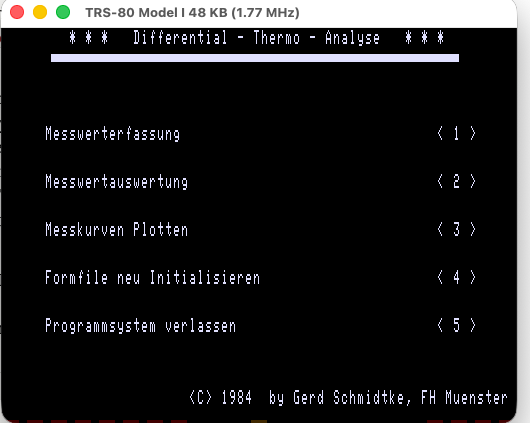
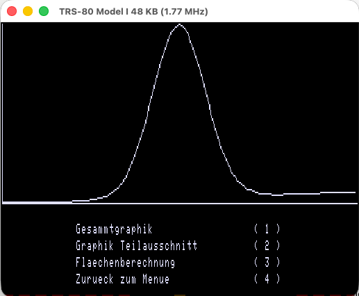
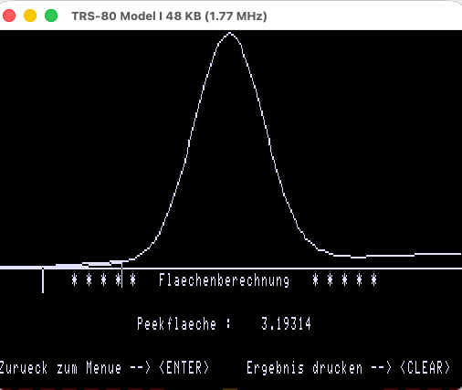

<!-- /software/dta/README.md — DTA-Programmsystem (Gerd Schmidtke, FH Münster, 1984) -->
<!-- (c) E. Schroeer -->
# DTA-Programmsystem — Differential-Thermo-Analyse (1984)

A measurement, evaluation, and plotting system for **Differential Thermal Analysis
(Differentialthermoanalyse)** on the TRS-80 Model I, written in Z80 assembler.

**Author:** Gerd Schmidtke, Dipl.-Ing. thesis (Diplomarbeit), FH Münster, 1984
**Copyright strings (binary-verified):**
- `'<C> 1984  by Gerd Schmidtke, FH Muenster'` (DTA.ASS line 590)
- `'* * *   Differential - Thermo - Analyse   * * *'` (DTA.ASS line 610)

## Historical context

This source code and program are close to my heart, even though I didn't write
them. The memories run deep, because back in those days the TRS-80 M1
represented a first real capability to measure lab data, store it, and then
reuse it — to check, control, and optimize.

And there is more. Working as a chemist in industry, I built numerous
process-automation systems in my labs, work that later led to one of the first
client-server-based LIMS systems, to name just one example. Why am I telling
this here? At CWH (Chemische Werke Hüls — the line runs IG Farben → CWH →
Hüls AG → Degussa-Hüls → today's Evonik Industries), two TRS-80 M1 machines
measured waste-water quality 24/7 in one of the labs, the CWH Umweltlabor —
until the early 1990s. Around the clock, for more than a decade. Let that
sink in.

These machines ran NEWDOS/80 — a highly capable DOS whose open,
user-modifiable design suited unattended measurement duty in a way stock
TRSDOS did not. Seen with today's knowledge and technology, this is all the
more astonishing: a machine Tandy initially expected to sell in the low
thousands went on to sell roughly a quarter million units — and ended up doing
serious laboratory work. Bespoke lab software of this kind was almost never
preserved; this Diplomarbeit code is among the few surviving sources
documenting what was actually done with this unique computer in professional
measurement settings.

## Provenance

The TRS-80 was coupled to a DTA instrument for the thesis; the printed
Diplomarbeit is currently lost. The surviving sources below were rescued from
disk. The graphics card is the HRG-1B by **RB (Rolf Best) Electronic GmbH,
Eitorf**; the driver software — both the large `HRG/CMD` and the compact
Dieter Bolz driver that Gerd dumped and disassembled — was **delivered with
the card** (owner testimony, E. Schroeer).

**Source disk:** [`esnd-40.dmk`](../../diskimages/NewDos/) — see the disk catalog
entry for the full file listing.
**Full functional DTA working disk:** [dta-work3.dsk](DMK/dta-work3.dsk)

## What Differential Thermal Analysis is

A sample and an inert reference are heated on the same temperature program. The
instrument records the temperature difference **ΔT** between them. When the sample
undergoes a thermal transition — melting, crystallization, decomposition — it
absorbs or releases heat and ΔT deviates from zero, producing a peak in the
ΔT-vs-time curve. The **area of that peak, measured against a baseline, is
proportional to the enthalpy of the transition**. This is why the evaluation
module below is built entirely around baseline construction and peak-area
integration.

## System overview

`DTA/CMD` is the master menu. On start it loads the resident HRG graphics driver
(`HRG/DUM`), checks/initializes `FORMFILE` (the sample-header form), then offers:

| Menu item | Program | Status |
|-----------|---------|--------|
| 1 — Messwerterfassung | `AUFNAHME/CMD` | **original lost** (not on esnd-40, not in catalog); its outputs — INHALT and measurement files — were synthesized for the 2026 runtime reconstruction, the program itself was not |
| 2 — Messwertauswertung | `AUSWERT/CMD` | original binary lost; **full source survives** (`AUSWERT/ASS`); zmac rebuild **runtime-validated 2026** |
| 3 — Messkurven Plotten | `PLOT/CMD` | **original lost**, no source, not reconstructed |
| 4 — Formfile neu initialisieren | (built into DTA/CMD) | present |
| 5 — Programmsystem verlassen | — | — |

Data files: `FORMFILE` (1024-byte header form; restored), `INHALT` (data
index written by AUFNAHME — original lost, format decoded, synthetic
replacement on the work disk), measurement files named by the user
(`Dateiname : ......../...`).

Measurement values are stored as **single bytes** (verified: `LD A,(IX+0)` reads
per sample in `GRAPH2`/`SUMV1`) — i.e. 8-bit ΔT samples, implying an 8-bit ADC in
the missing acquisition module (inference; the converter itself is not in the
surviving code).

## The evaluation algorithm (AUSWERT/ASS, binary-verified)

The peak-area computation (`FLAECH` → `BASIS` → `FNTFL1`) works as follows:

1. **Display & scaling.** The curve is drawn on the HRG (384×192) via the driver
   line routine at FC04H. Autoscaling: `FAKT1 = YFAK/(max−min)`,
   `FAKT2 = XFAK/(x_max−x_min)`; screen Y = 128 − (y−min)·FAKT1 (`DEHN`,
   `MINMAX`, `GRAPH2`).
2. **Boundary selection.** The user moves an inverted 14-pixel cursor with the
   arrow keys to mark first the left, then the right peak boundary (`CURSER`),
   with interval validation ("Intervall zu klein").
3. **Baseline.** A straight line is drawn between the curve values at the two
   boundaries; `FLBAS` = the trapezoid area beneath it:
   Δx·(y₁ + (y₂−y₁)/2). X values are pre-scaled by 0.01 (`FAKT4`) to keep
   higher powers within floating-point range.
4. **Piecewise least-squares cubic fit.** The interval is split into chunks of
   8–150 samples (`BASUP0/2/3` adjusts the chunk count until this holds). Per
   chunk, the normal-equation sums Σxᵏ and Σy·xᵏ are accumulated in **double
   precision** (`SUMV1`/`SUM`/`XSUM`/`YSUM`) and the 4×4 system is solved by
   matrix inversion (`INVERT`, with `UP2` as 4×4 matrix multiply) — four
   coefficients, i.e. a cubic. (The source comment says "Ausgleichsparabeln";
   the matrix dimensions show it is actually a cubic fit.)
5. **Analytic integration.** `FNTFL` forms the antiderivative
   f₄x⁴/4 + f₃x³/3 + f₂x²/2 + f₁x — the stored constants `FAKT5..7` = 1/4, 1/3,
   1/2 are these divisors — evaluates it at both chunk ends (Horner scheme,
   `KUBFNT`), and accumulates the differences into `FLPEEK` (double precision).
6. **Result.** Peakfläche = `FLPEEK` − `FLBAS`, converted to ASCII and shown;
   optional printer output with "Drucker nicht bereit" handling, and refusal
   while the plot program is resident.

Fitting a smooth polynomial before integrating suppresses quantization/ADC noise
instead of integrating it — a sound numerical design given 8-bit samples, and
notably careful work for 1984 Z80 assembler. Floating point uses the Level II
ROM routines (single 4-byte / double 8-byte, type flag at 40AFH, WRA1 at 4121H);
only the matrix algebra is hand-rolled.

## Surviving files

| File | Type | Content (binary-verified) |
|------|------|---------------------------|
| `DTA/ASS` | EDTASM source | Master menu, `ORG 5200H`. FCBs for HRG/DUM, FORMFILE, INHALT, AUFNAHME/CMD, AUSWERT/CMD, PLOT/CMD. Full-screen form editor for FORMFILE (arrow keys, SHIFT-arrows = delete/insert char, CLEAR = save). Buffers: FE00H (Inhalt), FF00H (Messwerte), 7000H (Messwertspeicher). |
| `AUSWERT/ASS` | EDTASM source, 1779 lines, fully commented | Evaluation module, `ORG 5832H`. See algorithm above. |
| `HRG/DUM` | /CMD load file, 780 bytes | Memory dump of a resident HRG BASIC-extension driver, load range FB10H–FDFFH, entry 0000H (dump, no autostart). Embedded copyright: **`(C) 1983 Dieter Bolz`**. Drives **ports 00H–05H** — the RB Electronic HRG-1B port map. Intercepts BASIC tokens (82H, 83H, 84H, 9CH, A2H, A6H, A9H, B8H, C6H) via the 4004H vector. **Not** derived from HRG/CMD: byte comparison shows 746 of 752 overlapping bytes differ. |
| `HRGDUM/ASS` | Disassembly | Disassembly of HRG/DUM, label-free (addresses literal). **Byte-verified** against HRG/DUM on the opening instruction sequence at FB10H (exact match); full-length diff pending. |
| `DTAST/ASS` | Disassembly fragment | Truncated copy of the same disassembly (first ~34 lines). |
| `CODE/ASS` | Disassembly fragment | Middle section of the same disassembly; contains the comment `;LAUT LISTING: LD B,D` — the disassembly was cross-checked against a **printed listing**, presumably from the Diplomarbeit. |
| `FORMFILE` | Data, 1024 bytes | **Verbatim dump of the Model I video RAM (3C00H–3FFFH)** used as an editable screen mask — the `SAVE` routine in DTA/ASS writes the screen byte-by-byte (LRECL=1) into this file and reloads it on start. Begins `name` + blanks. |

## Technical notes

- DOS file I/O uses the NEWDOS/80 entry points 4420H (open/create), 4424H (open
  existing), 4428H (close), 4436H (read), 4467H (print string) — consistent with
  the NEWDOS/80 system on esnd-40. Disk I/O is bracketed by `STOP`/`START1`,
  which patch the interrupt vector at 4012H (RET/JP) to disable the heartbeat
  during transfers.
- **HRG/DUM vs HRG/CMD — byte-compared, unrelated.** `HRG/CMD` (9,253 bytes,
  DB00H–FF24H, entry EB00H) also occupies FB10H–FDFFH, but with completely
  different code there: **746 of 752 overlapping bytes differ**. Both drivers
  address ports 00H–05H (HRG-1B), but HRG/DUM is a third program — Dieter
  Bolz's compact 1983 BASIC-extension driver — not a variant of HRG/CMD.

## How the pieces connect

```
                RB Electronic HRG-1B  (I/O ports 00H-05H)
                     ▲                          ▲
                     │ drives                   │ drives
        HRG/CMD  (9.2K driver,        Dieter Bolz driver, (C) 1983
        DB00-FF24, entry EB00)        resident at FB10-FDFF
        separate lineage,                       │
        unrelated code                          │ memory dump (Schmidtke)
                                                ▼
                                            HRG/DUM  (752 bytes)
                                                │
                                                │ disassembled
                                                ▼
                                           HRGDUM/ASS ◄── cross-checked against
                                                │          printed listing
                                                │          (";LAUT LISTING" in
                                                │          CODE/ASS; DTAST/ASS
                                                │          is a fragment copy)
                                                │ yields internal entry points
                                                ▼
                                  AUSWERT/ASS:  LINE1 EQU 0FC04H,
                                  coordinate cells FD7BH-FD81H
                                  (direct calls, BASIC bypassed)
                                                │
                                                ▼
              DTA-Programmsystem (DTA/CMD menu → AUFNAHME* / AUSWERT / PLOT*)
                                                │
                          FORMFILE = video-RAM screen mask (3C00H dump)
                                                │ same technique, 1984
                                                ▼
                          maske1/dum, maske2/dum — expert system, 1991
                                        (* = binary lost)
```
- **Working method (binary-verified):** the resident Bolz driver was dumped
  from memory (`HRG/DUM`), disassembled (`HRGDUM/ASS`, cross-checked against a
  printed listing per the `;LAUT LISTING` comments in `CODE/ASS`), and its
  internal routines were then reused directly from assembler — `AUSWERT`
  declares `LINE1 EQU 0FC04H` and writes coordinates straight into the driver's
  cells at FD7BH–FD81H, bypassing the BASIC token interface entirely. Dump →
  disassemble → call internals: locating usable entry points in source-less
  binaries, the same pattern seen elsewhere in this archive.
- **Screen-mask technique:** `FORMFILE` is a pre-rendered full-screen form
  saved as a raw video-RAM dump and reloaded in one pass — conceptually
  identical to `maske1/dum`/`maske2/dum` in the
  [expert system](../expertsystem/) (1991), which draws forms once with
  `maskgen.bas` and reloads them via `CMD"load"`. The DTA system (1984) is the
  earlier of the two occurrences in this archive; here the mask is additionally
  editable in place via the built-in full-screen editor. The same idiom
  appears in its lighter form as the dotted fill-in field
  `Dateiname : ......../...` (TEXT1, written to video RAM at 3F80H, the
  filename over-typed in place at 3F8CH) — the fill-in-form UI of the
  expert system's `wbedit`, five years earlier.

## Runtime reconstruction (2026)

The evaluation pipeline was brought back to execution in sdltrs, 42 years
after the Diplomarbeit. Work disk: `dta-work3.dsk` (a copy-chain from
esnd-40.dmk; the original image is untouched). PDRIVE for the disk:
`TC=40, SPT=10, TSR=0, GPL=2, DDSL=17, DDGA=2`.

**Original components, restored:** `DTA/CMD` (on-disk original), `FORMFILE`
(restored from its KILLed entry; byte-identical to the independently
preserved copy), `HRG/DUM` (on-disk original, loaded resident by DTA).

**Modern additions, clearly non-original:** `AUSWERT/CMD` rebuilt from
`AUSWERT/ASS` with zmac (original binary lost); `INHALT` and `PEAK1/DAT` /
`PEAK2/DAT` synthesized (see below). These live only on the work disk.

**INHALT format, decoded from the AUSWERT parser (binary-verified):** a
plain byte stream of measurement-file names, each terminated by 0DH; byte
03H is skipped as filler; a `:d` drive suffix is displayed but terminated at
the colon for the FCB. On read past EOF (DOS error 28) the file is rewound
via 443FH — the down-arrow cycles through the list. INHALT was presumably
written by the lost AUFNAHME/CMD.

**Measurement-file format:** AUSWERT computes the sample count as
file-size/2 and reads that many sequential bytes — the first half of the
file holds the 8-bit ΔT samples; the second half's purpose is unknown
(AUFNAHME would tell). Synthetic files were built accordingly: 200 samples
(Gaussian peak, height 150 resp. 75, sigma 15, on a drifting baseline of
~40) plus 200 padding bytes.

**How the mock-up was built (reproducible):**

1. `AUSWERT/CMD` rebuild: `AUSWERT/ASS` extracted from esnd-40, EDTASM
   line numbers and high bits stripped (`edtasm-strip.py`), assembled with
   **zmac** — zero errors; the /CMD matches the source's `ORG 5832H` and
   `END 402DH` (27 load records, 5832H–73D7H).
2. `INHALT`: 24 bytes, built to the decoded format —
   `"PEAK1/DAT:0\r" + "PEAK2/DAT:0\r"`.
3. `PEAK1/DAT` / `PEAK2/DAT`: 400 bytes each. First 200 bytes = samples
   `min(255, 40 + i·10/200 + H·exp(−(i−100)²/(2·15²)))` for i = 0…199,
   with H = 150 (PEAK1) resp. 75 (PEAK2); second 200 bytes = padding
   (last sample repeated), satisfying the size/2 sample-count rule.
4. Disk build with **trsextract** (each write to a copy, original
   untouched): restore FORMFILE, then `--write-file` AUSWERT/CMD, INHALT,
   PEAK1/DAT, PEAK2/DAT → `dta-work3.dsk`. Every file extracted back and
   byte-compared against its source.
5. sdltrs: HRG-1B emulation on, PDRIVE as above, boot NEWDOS/80, `DTA/CMD`.

**Validated at runtime:** menu → FORMFILE found (no init detour) →
AUSWERT/CMD chained and executed → INHALT parsed, `Dateiname : PEAK1/DAT:0`
displayed → ENTER → curve loaded, autoscaled, drawn on the HRG via the
resident Bolz driver (LINE at FC04H) → Flaechenberechnung: boundary cursors,
baseline, piecewise cubic fit, Peakfläche displayed with printer option.
The file-size/2 sample-count reading is confirmed (complete curve, no
truncation).

Screenshots (sdltrs, TRS-80 Model I 48K, HRG-1B):





**Peakfläche observations:** the result is strongly sensitive to boundary
placement — three runs on identical data gave 3.19314, 0.898252 and
−1.66937. The mechanism: the baseline is the chord between the curve values
at the two chosen boundaries; an endpoint on a peak flank inflates FLBAS and
can push the signed result negative (the code reports the sign honestly).
This operator-dependence is authentic to 1980s manual-baseline DTA practice.
OPEN: the absolute scale of the number (which coordinate space FLAECH
integrates in) is not yet established; a linearity test (PEAK2 = half
height, expected ratio 0.5 for raw-value integration vs ~1.0 for autoscaled
coordinates) is prepared on `dta-work3.dsk` and pending.

**Screen-clear observation:** the source clears the HRG before every plot
(`GRAPH` opens with CLS + HRGCLS; HRGCLS calls the Bolz driver's clear
routine at 0FBCFH — verified in the dump as a 48×256 = 12,288-write loop,
exactly the card's video RAM size). In the 2026 runtime environment the
routine executes but the screen does not wipe, so successive plots overlay.
The source's intent is unambiguous; whether the clear worked on the 1984
hardware cannot be determined from the surviving material.

## Open items
- Locate `PLOT/CMD` and the original `AUSWERT/CMD` binary (a zmac rebuild
  from AUSWERT/ASS now exists and is runtime-validated, but a recovered
  original would allow a byte-diff against the rebuild).
- Peakfläche coordinate space: run the prepared linearity test on
  `dta-work3.dsk` (PEAK1 vs PEAK2, same boundaries; ratio ≈ 0.5 → raw-value
  integration, ≈ 1.0 → autoscaled coordinates).
- Identify **Dieter Bolz** — per the RB-delivery provenance, likely the
  author of (part of) the driver software RB Electronic shipped with the
  HRG-1B. Original RB delivery disks/documentation would confirm.
- Complete the full-length instruction diff of `HRGDUM/ASS` against `HRG/DUM`
  (opening sequence already verified).
